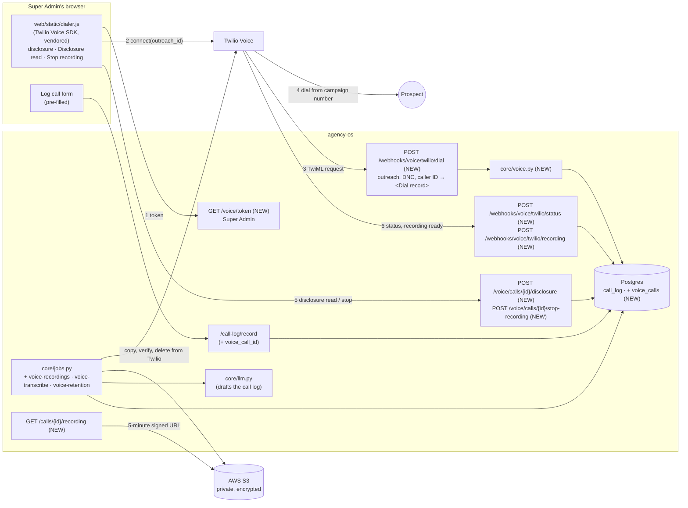

# Browser calling, recording and call notes

Spec for **placing prospect calls from the dashboard** (a Twilio softphone in the
browser), **recording them after a disclosure**, storing the recordings in **AWS
S3**, and **turning the recording into a drafted call log**. Written in the same
format as [MAILER_FOLLOWUP_CALLS.md](MAILER_FOLLOWUP_CALLS.md): diagrams are
Mermaid, the contract is YAML, and tasks have file paths and acceptance checks.

Status (2026-10-08): **V1 and V2 built** (dialing from the dashboard with the consent record, the Call button and call bar, and the pre-filled Log call form). V3 onward is proposed; V3 waits on counsel's review of the disclosure. Decided: dialing is Super
Admin only, caller ID is set per campaign, recordings are stored in AWS S3. Later
(V8), Owners connect their own Twilio accounts with Twilio Connect. Calling is a
plugin category (`plugins/voice/`) with Twilio as the only provider for now, and a
mobile phase (V9–V10) follows. The last phase (V11–V13) makes call scripts
dynamic: Owners edit the parts of a script that are marked editable, every version
is tracked against call outcomes, and AI suggests changes based on successful
calls, which an Owner approves. The remaining
open questions are in section 9.

## Goal

Today a rep taps a `tel:` link ([web/app.py](../web/app.py), `tel_href`) and the
call happens on their phone, outside agency-os. Afterwards they fill in the
**Log call** form from memory. So:

- There's no recording, so nobody can review a call, coach from it or check what
  was promised.
- `duration_minutes` and the outcome are typed by hand, and often skipped.
- Notes are only as good as the rep's memory.

This spec adds a **Call** button that dials through Twilio Voice from the
browser. The rep reads a recording disclosure first, Twilio records the call,
agency-os moves the recording to S3, a job transcribes it, and the Log call form
opens pre-filled (duration, outcome and a drafted summary) for the rep to
confirm. The `tel:` link stays as the fallback when voice isn't configured.

**Why not a browser extension.** An extension can only record audio that passes
through a browser tab, and `tel:` calls never do. Once calls run in the
dashboard, Twilio records them on its side. That works from any machine, survives
a closed tab and doesn't depend on files kept in one browser. A Google Meet
recorder is a separate idea and is out of scope here (see Q5).

## Use cases

| # | Actor | Scenario | Outcome |
|---|---|---|---|
| UC1 | Super Admin | Opens a prospect (or a call script) and clicks **Call Dana Lee** | The browser asks for microphone access the first time, then dials the outreach's `contact_phone` from **the campaign's caller ID**. A call bar shows the timer, Mute, Hang up and the disclosure to read. |
| UC2 | Super Admin | The prospect answers | The call bar shows the disclosure in large type with the prospect's state ("CA: all-party consent"). The rep reads it first, then presses **Disclosure read**. |
| UC3 | Prospect | Says they don't want to be recorded | The rep presses **Stop recording**. The recording is discarded, and the call continues unrecorded. |
| UC4 | System | The rep never presses **Disclosure read** | The recording is discarded when the call ends. Nothing is kept without a confirmed disclosure. |
| UC5 | System | The call ends | The Log call form opens with the call attached: exact duration, an outcome guessed from Twilio's status (`no-answer` → No answer, `busy` → Busy signal, `failed` → Disconnected), and the script that was open. |
| UC6 | System | The recording is ready | agency-os copies it to S3, checks the copy, and deletes it from Twilio. A job transcribes it, and if AI is on, drafts `notes`, `interest_level`, `next_step`, `next_step_date` and the decision maker. The rep sees the draft marked "AI draft, check before saving". Nothing is saved without the rep. |
| UC7 | Owner / Admin | Reviews a call | Plays the recording and reads the transcript from the call log or the prospect timeline, if they can see that campaign. |
| UC8 | Super Admin | Prospect is marked `do_not_call` | The Call button is disabled with the reason, and the server refuses to dial even if asked directly. |
| UC9 | System | Recording is older than the retention period | The job deletes it from S3 and clears the transcript, keeping the call log row. |
| UC10 | Anyone else | Isn't a Super Admin, or the campaign has no caller ID, or voice isn't configured | The `tel:` link works exactly as it does today. |

## Constraints that shape the design

| Fact | Consequence |
|---|---|
| Some states require **every party's consent** to record a call (section 3), including California, where several campaigns call. When a call crosses state lines, the stricter state's law can apply, and a prospect's `state` in our data is often missing or is the organization's address rather than where the person is sitting. | **Every recorded call gets the disclosure, in every state.** The prospect's state is stored on the call and shown to the rep, but it never turns the disclosure off. |
| The TCPA restricts calls to mobile numbers that use an **artificial or prerecorded voice** without prior consent, and the FCC treats AI and text-to-speech voices as artificial. | The disclosure is **read live by the rep**, not played as a recording or text-to-speech. Counsel to confirm (Q1). |
| A TwiML endpoint that dials whatever number it's given is a toll-fraud hole. | The browser sends an **`outreach_id`**, never a phone number. The server looks up the number, checks the caller is a Super Admin, checks `do_not_call`, and only then returns `<Dial>`. |
| **Decided:** dialing is Super Admin only, like `lob_direct_mail`, until costs and liabilities are understood. | `GET /voice/token` uses the existing `SUPER_ADMIN` route rule (`core/access.py`), and the voice webhook checks `user.is_super_admin` again. No new permission for now; a `calls.dial` permission is the likely shape later. |
| **Decided:** one caller ID per campaign. | `voice.caller_id` in `campaign.yaml` is required for browser calling. A campaign without one keeps the `tel:` link. The number must be a voice-capable number on the Twilio account. |
| **Decided:** recordings are stored in AWS S3, not on Twilio or in Postgres (Postgres on Railway has no file storage). | After Twilio reports a recording, agency-os copies it to a private, encrypted S3 bucket and deletes it from Twilio. Postgres stores only the S3 key, duration and transcript text. |
| Twilio already holds the account (`TWILIO_ACCOUNT_SID`, `TWILIO_AUTH_TOKEN`) for SMS. | Voice reuses it. It adds an API key (for browser access tokens) and a TwiML App whose Voice URL points at agency-os. |
| Twilio charges per minute for calls; S3 charges for storage. | Super Admin only keeps call spend controlled; the retention job and S3 lifecycle limit storage. |
| The dashboard loads no third-party scripts (everything is in `web/static/`). | The Twilio Voice JS SDK (`@twilio/voice-sdk` v2) is **vendored** into `web/static/vendor/`, pinned to a version. |
| AI features are optional and gated (`AGENCY_OS_AI`, `user.uses_ai`). | Transcription and the drafted call log run only when AI is on. Recording and playback work without it. |
| `call_log` rows are written by the rep through `/call-log/record`, which drives stage changes, `do_not_call` and royalties. | The softphone never writes `call_log` itself. It records a `voice_calls` row, and the rep's form submission links the two. |
| Outreach providers are plugins behind a shared interface (`plugins/channels/`, `plugins/schedulers/`, defined in `core/protocols.py`). Calendly books meetings but can't place calls. | Calling is a plugin category too: **`plugins/voice/`**, with Twilio as the only provider for now. Anything specific to Twilio goes behind a `VoiceProvider` interface; the disclosure, consent and `do_not_call` rules, the S3 copy, transcription, the AI draft and the call log stay shared in `core/voice.py`. Each call records its `provider`. |

## 1. System map



## 2. Lifecycle (one call)

```mermaid
sequenceDiagram
  participant Rep as Super Admin (browser)
  participant AOS as agency-os
  participant TW as Twilio
  participant P as Prospect
  participant S3 as AWS S3

  Rep->>AOS: GET /voice/token
  AOS-->>Rep: access token (identity = user id, 1 h)
  Rep->>TW: Device.connect({outreach_id})
  TW->>AOS: POST /webhooks/voice/twilio/dial (signed)
  AOS->>AOS: Super Admin? do_not_call? phone dialable? campaign caller ID?
  AOS->>AOS: voice_calls += (call_sid, outreach, caller_id, prospect_state, disclosure_version)
  AOS-->>TW: <Dial callerId=campaign record="record-from-answer-dual"><Number>
  TW->>P: rings from the campaign's number
  P->>TW: answers (recording starts)
  Rep->>P: reads the disclosure (first thing said)
  Rep->>AOS: POST /voice/calls/{id}/disclosure
  Note over Rep,P: conversation
  opt Prospect objects
    Rep->>AOS: POST /voice/calls/{id}/stop-recording
    AOS->>TW: stop recording; discard it
  end
  Rep->>TW: hang up
  TW->>AOS: status callback (completed, duration)
  AOS-->>Rep: Log call form opens: duration, outcome guess, voice_call_id
  TW->>AOS: recording callback (RecordingSid, duration)
  AOS->>AOS: no disclosure confirmed? → delete recording, stop here
  AOS->>TW: fetch audio
  AOS->>S3: put recordings/<campaign>/<voice_call_id>.wav
  AOS->>TW: delete recording (after S3 copy verified)
  AOS->>AOS: transcribe → AI draft
  Rep->>AOS: reviews draft, POST /call-log/record (voice_call_id)
  AOS->>AOS: call_log row · voice_calls.call_log_id set
```

If the rep submits the form before the draft is ready, the call log saves without
it. The transcript still attaches to the call when it arrives, and the call log
page shows it.

## 3. Recording disclosure (draft for counsel)

> **This is a working draft, not legal advice.** The wording, the live-read
> approach and the state list below must be reviewed by counsel before recording
> is turned on for any campaign (Q1). V1 builds the plumbing so the reviewed text
> drops into config without code changes.

### What the rep says

The rep reads this **before anything else**, as soon as someone answers. The call
bar shows it in large type, with the campaign's company name filled in:

> "Hi, this is {rep_first_name} calling from **{company_name}**. Just so you know,
> this call is being recorded for quality and training purposes. Is that all right
> with you?"

- **If they say yes, or carry on talking:** press **Disclosure read** and continue
  with the script.
- **If they say no or hesitate:** press **Stop recording**, then say:

  > "No problem, I've turned the recording off. Nothing from this call will be
  > kept."

- **If someone else answers (a receptionist or gatekeeper) and transfers the
  call:** read the disclosure again to the new person.
- **If they ask later in the call:** "Yes, we record calls so our team can review
  them for quality and training. I'm happy to turn it off." Then do what they ask.
- **Voicemail:** no disclosure is needed, because the rep's message is the only
  voice on the recording. Don't read one.

### Rules the system enforces

| Rule | How |
|---|---|
| The disclosure is read on **every recorded call**, in every state. | The call bar always shows it; there's no setting to turn it off. |
| No disclosure confirmed, no recording kept. | If the rep doesn't press **Disclosure read**, the recording is deleted from Twilio when the call ends and is never copied to S3. |
| An objection discards the recording. | **Stop recording** stops it on Twilio and deletes it, including the part before the objection. |
| The exact text is kept as evidence. | `voice_calls.disclosure_version` stores a hash of the text shown, and `disclosure_read_at` stores when the rep confirmed it. Old versions are kept in `core/voice.py` (`DISCLOSURES`). |
| The rep knows the prospect's state rules. | The call bar shows "CA: all-party consent", "TX: one-party consent", or "State unknown: treat as all-party". |

### State reference

Shown to the rep and stored on each call (`voice_calls.prospect_state`). It never
switches the disclosure off. `core/voice.py` keeps this list as
`ALL_PARTY_CONSENT_STATES`. **Counsel to confirm the list (Q1); several states are
disputed or depend on the kind of call.**

| Treated as all-party consent | Notes |
|---|---|
| CA | Calls into California from out of state are covered too (*Kearney v. Salomon Smith Barney*, 2006). Several campaigns call here. |
| FL, IL, MD, MA, MT, NH, PA, WA | Commonly listed as all-party for phone calls. |
| CT | All-party consent for recording phone calls (civil liability). |
| DE, MI, NV, OR | Disputed or depends on the kind of call (Oregon is one-party for phone calls but all-party in person). Treat as all-party. |
| Unknown or missing state | Treat as all-party. |
| Every other state | One-party consent. The disclosure is still read. |

## 4. Rules

- **Dial only known numbers.** `/webhooks/voice/twilio/dial` takes `outreach_id` and the
  caller's identity from the access token. It dials `tel_href(outreach.contact_phone)`
  only if the user is a Super Admin and the campaign has a `voice.caller_id`.
  Anything else gets `<Say>` and `<Hangup/>` and is written to the audit log.
- **Respect "stop".** A prospect with `do_not_call = 1` is never dialed. The button is
  disabled and the endpoint refuses.
- **Record only with a disclosure.** `<Dial>` records only if the campaign has
  `voice.record: true` and a `company_name`. A recording is kept only if
  `disclosure_read_at` is set and `recording_stopped_at` isn't (section 3).
- **Outcome guess, not outcome.** Twilio's final `DialCallStatus` pre-selects the
  outcome (`completed` → Completed, `no-answer` → No answer, `busy` → Busy signal,
  `failed`/`canceled` → Disconnected). The rep can change it, and the existing
  `CALL_OUTCOMES` check still applies.
- **The AI drafts, the rep decides.** Draft fields fill the form; they're never
  written to `call_log` without the rep pressing Save. The model is asked for JSON
  matching the form (`core.llm.generate(..., json_schema=…)`), and any
  `interest_level` it returns must be one of `high | medium | low | not_interested`.
- **One voice call, one call log.** `voice_calls.call_log_id` is unique. Logging a
  second call log against the same voice call is refused.
- **Delete from Twilio only after S3 has it.** The copy is checked (S3 `HeadObject`
  size matches the downloaded bytes) before the Twilio recording is deleted. A
  failed copy is retried on the next job run.

## 5. Contract (machine-readable)

```yaml
# campaigns/<slug>/campaign.yaml
voice:
  caller_id: "+13105550123"       # required for browser calling; a voice number on the Twilio account
  company_name: "U9itus"          # spoken in the disclosure
  record: true                    # default false: no recording until counsel signs off
```

```yaml
twilio_voice:
  twiml_app:                        # Twilio Console → Voice → TwiML Apps
    voice_url: POST https://<dashboard>/webhooks/voice/twilio/dial
  dial:
    callerId: campaign.voice.caller_id
    record: record-from-answer-dual # one channel per side (talk-time later, V7)
    recordingStatusCallback: POST /webhooks/voice/twilio/recording
    action: POST /webhooks/voice/twilio/status   # final DialCallStatus + DialCallDuration
  stop_recording: POST /2010-04-01/Accounts/{sid}/Calls/{call_sid}/Recordings/{rec_sid}.json  Status=stopped
  auth: X-Twilio-Signature          # HMAC-SHA1 of URL + sorted params with TWILIO_AUTH_TOKEN
  access_token:
    grant: VoiceGrant(outgoing_application_sid=TWILIO_TWIML_APP_SID, incoming_allow=false)
    identity: "user-<users.id>"
    ttl_seconds: 3600
  maps_to:
    "status completed": voice_calls.status = completed, duration_seconds
    "status no-answer | busy | failed | canceled": voice_calls.status
    "recording completed": voice_calls.recording_sid, recording_seconds
```

```yaml
aws_s3:
  bucket: $AGENCY_OS_RECORDINGS_BUCKET   # private; Block Public Access on
  region: $AWS_REGION
  key: recordings/<campaign_slug>/<voice_call_id>.wav
  encryption: SSE-S3 (AES-256), or SSE-KMS if you want key-level audit
  playback: presigned GET, 5 minutes, issued only after the permission check
  iam_policy:                            # the agency-os user can only touch this prefix
    actions: [s3:PutObject, s3:GetObject, s3:DeleteObject]
    resource: arn:aws:s3:::<bucket>/recordings/*
  lifecycle: expire recordings/* after AGENCY_OS_RECORDING_DAYS + 7 (a backstop for the job)
  library: boto3 (requirements-aws.txt, optional like requirements-payments.txt)
```

New table (V1):

```sql
CREATE TABLE IF NOT EXISTS voice_calls (
    id INTEGER GENERATED BY DEFAULT AS IDENTITY PRIMARY KEY,
    provider TEXT NOT NULL DEFAULT 'twilio', -- plugins/voice/ key that placed the call
    call_sid TEXT NOT NULL,                  -- the provider's call ID (Twilio: the browser leg)
    outreach_id INTEGER NOT NULL REFERENCES outreach(id) ON DELETE CASCADE,
    campaign_id INTEGER NOT NULL REFERENCES campaigns(id) ON DELETE CASCADE,
    prospect_id INTEGER NOT NULL REFERENCES prospects(id) ON DELETE CASCADE,
    user_id INTEGER REFERENCES users(id) ON DELETE SET NULL,
    caller_id TEXT NOT NULL,                 -- the campaign number it was placed from
    to_number TEXT NOT NULL,                 -- E.164, as dialed
    prospect_state TEXT,                     -- two-letter state at call time, or NULL if unknown
    all_party_consent INTEGER NOT NULL DEFAULT 1, -- from ALL_PARTY_CONSENT_STATES; 1 when unknown
    disclosure_version TEXT,                 -- hash of the disclosure text shown to the rep
    disclosure_read_at TIMESTAMP,            -- rep pressed "Disclosure read"
    recording_stopped_at TIMESTAMP,          -- rep pressed "Stop recording" (recording discarded)
    status TEXT NOT NULL DEFAULT 'initiated',-- initiated | completed | no-answer | busy | failed | canceled
    duration_seconds INTEGER,
    recorded INTEGER NOT NULL DEFAULT 0,     -- recording requested on the <Dial>
    recording_sid TEXT,                      -- cleared once deleted from Twilio
    recording_seconds INTEGER,
    s3_key TEXT,                             -- set once the copy is verified
    recording_deleted_at TIMESTAMP,          -- retention, or discarded for consent
    transcript TEXT,                         -- "Rep: … / Prospect: …" turns
    ai_draft TEXT,                           -- JSON of drafted call log fields
    call_log_id INTEGER UNIQUE REFERENCES call_log(id) ON DELETE SET NULL,
    started_at TIMESTAMP DEFAULT CURRENT_TIMESTAMP,
    ended_at TIMESTAMP
);
CREATE UNIQUE INDEX IF NOT EXISTS idx_voice_calls_provider_sid ON voice_calls(provider, call_sid);
CREATE INDEX IF NOT EXISTS idx_voice_calls_prospect ON voice_calls(prospect_id);
CREATE INDEX IF NOT EXISTS idx_voice_calls_pending ON voice_calls(recording_sid) WHERE s3_key IS NULL;
```

Routes (`core/access.py`):

```yaml
routes:
  "GET /voice/token": "@super_admin"                        # access.SUPER_ADMIN
  "POST /voice/calls/{id}/disclosure": "@super_admin"       # and only the user who placed the call
  "POST /voice/calls/{id}/stop-recording": "@super_admin"   # same
  "GET /calls/{id}/recording": calls.view                   # plus sees_campaign on the call's campaign
  "/webhooks/voice/*": no login; X-Twilio-Signature required
```

Voice provider interface (V1, `core/protocols.py`), implemented by
`plugins/voice/twilio_voice.py`:

```yaml
VoiceProvider:
  key: "twilio"
  configured() -> bool                                  # settings present
  access_token(user, connection) -> str                 # what the browser or app SDK needs
  dial_response(call: VoiceCall, record: bool) -> str   # the provider's call instructions (TwiML for Twilio)
  verify_webhook(url, params, headers) -> bool
  parse_status(params) -> {call_sid, status, duration_seconds}
  parse_recording(params) -> {call_sid, recording_id, recording_seconds}
  stop_recording(call: VoiceCall) -> None
  fetch_recording(call: VoiceCall) -> bytes             # for the S3 copy
  delete_recording(call: VoiceCall) -> None
  bridge_call(call: VoiceCall, rep_number: str) -> str  # V9: ring the rep's phone, then the prospect
```

`core/voice.py` calls only these methods. Webhook routes are
`/webhooks/voice/{provider}/…`, so Twilio's are `/webhooks/voice/twilio/…`.

Per-owner Twilio (V8):

```yaml
twilio_connect:                      # Twilio Console → Connect Apps (one app for agency-os)
  authorize: https://www.twilio.com/authorize/<CONNECT_APP_SID>?state=<signed nonce for the owner>
  authorize_url: GET https://<dashboard>/twilio/connect/callback   # receives AccountSid + state
  deauthorize_url: POST https://<dashboard>/webhooks/twilio/deauthorize
  permissions: [get-all, post-all]   # charge for usage; ask for nothing more
  requests: Account SID = the owner's Connect sub-account, signed with our own credentials
  numbers: bought inside the Connect sub-account (the owner's main-account numbers aren't reachable)
campaign_account:                    # which Twilio account a campaign's calls run on
  rule: the campaign's chosen owner connection (voice.twilio_owner), else the platform account
  platform_account: TWILIO_ACCOUNT_SID (V1–V7, Super Admin only)
routes:
  "GET /twilio/connect": owner           # starts the authorize flow for the signed-in Owner
  "GET /twilio/connect/callback": owner  # state must match the Owner who started it
  "POST /twilio/connect/disconnect": owner
permissions:
  calls.dial: "Place calls from the dashboard on a connected Twilio account"
```

```sql
CREATE TABLE IF NOT EXISTS twilio_connections (
    id INTEGER GENERATED BY DEFAULT AS IDENTITY PRIMARY KEY,
    owner_id INTEGER NOT NULL UNIQUE REFERENCES users(id) ON DELETE CASCADE,
    account_sid TEXT NOT NULL UNIQUE,     -- the Connect sub-account (not a secret)
    twiml_app_sid TEXT,                   -- created in the sub-account during setup
    api_key_sid TEXT,                     -- if Connect allows creating one (spike, V8a)
    status TEXT NOT NULL DEFAULT 'active',-- active | deauthorized
    connected_at TIMESTAMP DEFAULT CURRENT_TIMESTAMP,
    deauthorized_at TIMESTAMP
);
ALTER TABLE voice_calls ADD COLUMN IF NOT EXISTS twilio_connection_id INTEGER
    REFERENCES twilio_connections(id) ON DELETE SET NULL;  -- NULL = platform account
```

```yaml
# campaigns/<slug>/campaign.yaml (V8)
voice:
  twilio_owner: owner@example.com   # whose connected Twilio this campaign calls on; must be a campaign owner
  caller_id: "+13105550123"         # a number in that owner's Connect sub-account
```

Dynamic call scripts (V11–V13):

A script's `body` is already divided into sections by divider lines
(`── WHO WE ARE (15 seconds) ──`). Each section's ID is its heading as a slug
(`who_we_are`). Campaign authors mark which sections Owners may edit; **every
section not listed is locked**, and only a Super Admin can change it.

```yaml
# campaigns/<slug>/scripts/phone_00_cold_call.yaml
key: phone_cold_call
body: |
  ── OPENING ──
  …
sections:                       # optional; without it the whole script is locked
  opening: {editable: true}
  who_we_are: {editable: true}
  why_them: {editable: true}
  the_ask: {editable: true}
  if_not_interested: {editable: false}   # stop / do-not-call handling stays fixed
  if_gatekeeper: {editable: true}
success:                        # what counts as a successful call for this script (Q12)
  outcomes: [completed, scheduled]
  any_of:
    interest_level: [high]
    stage_within_days: {stage: demo_scheduled, days: 14}   # e.g. a Calendly booking followed
```

```sql
-- Every saved version of a script. The active version is also written to
-- campaign_files, so /call-scripts, printing and load_script keep working unchanged.
CREATE TABLE IF NOT EXISTS script_versions (
    id INTEGER GENERATED BY DEFAULT AS IDENTITY PRIMARY KEY,
    campaign TEXT NOT NULL,
    script_key TEXT NOT NULL,
    version INTEGER NOT NULL,
    body TEXT NOT NULL,
    changed_sections TEXT,               -- JSON list of section IDs changed from the parent
    parent_version INTEGER,
    source TEXT NOT NULL DEFAULT 'manual', -- manual | ai_suggestion | seed
    suggestion_id INTEGER,               -- set when source = ai_suggestion
    status TEXT NOT NULL DEFAULT 'active', -- active | testing | retired
    author_user_id INTEGER REFERENCES users(id) ON DELETE SET NULL,
    created_at TIMESTAMP DEFAULT CURRENT_TIMESTAMP,
    UNIQUE (campaign, script_key, version)
);
CREATE UNIQUE INDEX IF NOT EXISTS idx_script_versions_active
    ON script_versions(campaign, script_key) WHERE status = 'active';

-- AI-proposed changes waiting for an Owner (V13). Never applied automatically.
CREATE TABLE IF NOT EXISTS script_suggestions (
    id INTEGER GENERATED BY DEFAULT AS IDENTITY PRIMARY KEY,
    campaign TEXT NOT NULL,
    script_key TEXT NOT NULL,
    base_version INTEGER NOT NULL,
    section TEXT NOT NULL,               -- an editable section ID only
    proposed_text TEXT NOT NULL,
    rationale TEXT NOT NULL,             -- why, in plain words
    evidence_call_ids TEXT NOT NULL,     -- JSON list of voice_calls IDs (no copied transcript text)
    status TEXT NOT NULL DEFAULT 'pending', -- pending | accepted | edited | rejected | superseded
    reviewed_by INTEGER REFERENCES users(id) ON DELETE SET NULL,
    reviewed_at TIMESTAMP,
    created_at TIMESTAMP DEFAULT CURRENT_TIMESTAMP
);

ALTER TABLE call_log ADD COLUMN IF NOT EXISTS script_version INTEGER;  -- the version on screen
```

```yaml
permissions:
  scripts.view: "View call scripts and how each version performs"
  scripts.edit: "Edit the editable sections of call scripts in campaigns you own"
routes:
  "GET /call-scripts/{campaign}/{script_key}/edit": scripts.edit       # plus sees_campaign
  "POST /call-scripts/{campaign}/{script_key}/save": scripts.edit      # locked sections: Super Admin only
  "GET /call-scripts/{campaign}/{script_key}/versions": scripts.view
  "POST /call-scripts/{campaign}/{script_key}/versions/{version}/activate": scripts.edit
  "GET /call-scripts/suggestions": scripts.edit
  "POST /call-scripts/suggestions/{id}/{accept|reject}": scripts.edit
```

## 6. Setup

1. **Twilio numbers:** buy (or port) one voice-capable number **per campaign** that
   will call. Register each for caller ID reputation (Trust Hub / SHAKEN/STIR) so
   calls aren't shown as spam, and decide where callbacks to it go (Q6).
2. **Twilio API key:** Account → API keys. Set `TWILIO_API_KEY_SID` and
   `TWILIO_API_KEY_SECRET`.
3. **TwiML App:** Voice URL `https://<dashboard>/webhooks/voice/twilio/dial` (POST). Set
   `TWILIO_TWIML_APP_SID`. Until these three are set, the Call button doesn't
   appear and the `tel:` link is used.
4. **AWS:** create a private S3 bucket with Block Public Access on and default
   encryption, add the lifecycle rule from section 5, and create an IAM user (or
   role) limited to `recordings/*` in that bucket. Set `AWS_ACCESS_KEY_ID`,
   `AWS_SECRET_ACCESS_KEY`, `AWS_REGION` and `AGENCY_OS_RECORDINGS_BUCKET`. Install
   `requirements-aws.txt` (Docker: `--build-arg WITH_AWS=1`). Until this is set,
   recording is off even if a campaign asks for it.
5. Per campaign, add a `voice:` block with `caller_id` and `company_name`. Add
   `record: true` only after counsel has approved the disclosure.
6. Optional: `AGENCY_OS_RECORDING_DAYS` (default 90), `AGENCY_OS_TRANSCRIBE` (see Q2).
7. For copying, transcription and retention: `AGENCY_OS_RUN_JOBS=1`.
8. `python -m tools.doctor` checks the voice settings, that each campaign's
   `caller_id` is a voice number on the account, and that the bucket is reachable
   and not public.
9. **Per-owner Twilio (V8):** in the Twilio Console, create a Connect App for
   agency-os with the authorize and deauthorize URLs from section 5 and only the
   permissions listed there. Set `TWILIO_CONNECT_APP_SID`. Owners then connect from
   **Account → Twilio**, pick or buy a number for each campaign they own, and a Super
   Admin grants `calls.dial` to the roles that should dial.

## 7. Tasks

| ID | Task | Files | Acceptance check |
|---|---|---|---|
| V1 ✓ | **Server side of dialing, with the consent record.** Settings check; access token (`SUPER_ADMIN` route rule); campaign `voice:` block (`caller_id` required, `company_name`, `record`); `voice_calls` table; `/webhooks/voice/twilio/dial` (outreach lookup, Super Admin, `do_not_call`, campaign `callerId`, `<Dial>`); `/webhooks/voice/twilio/status`; Twilio signature check. `DISCLOSURES` (versioned text from section 3) and `ALL_PARTY_CONSENT_STATES`; each call stores `prospect_state`, `all_party_consent` and `disclosure_version`; `POST /voice/calls/{id}/disclosure` sets `disclosure_read_at` | `core/voice.py` (NEW), `core/protocols.py` (`VoiceProvider`), `plugins/voice/__init__.py` (NEW), `plugins/voice/_base.py` (NEW), `plugins/voice/twilio_voice.py` (NEW), `core/db.py`, `core/campaign.py`, `core/access.py`, `web/app.py`, `.env.example`, `tests/test_voice.py` (NEW) | Tests: `core/voice.py` imports nothing from Twilio, and the consent and `do_not_call` tests pass against a fake provider as well as Twilio; unsigned or wrongly signed requests get 401; a non–Super Admin gets 403 on `/voice/token` and `<Hangup/>` from the webhook; a `do_not_call` prospect, an undialable phone or a campaign with no `caller_id` gets `<Hangup/>` and no row; a valid request returns `<Dial callerId="<campaign number>">` to the outreach's E.164 number and records one row with the prospect's state, `all_party_consent` (1 for CA and for a missing state, 0 for TX) and the current `disclosure_version`; the disclosure endpoint works only for the user who placed the call; a status callback sets status and duration once (replays change nothing). |
| V2 ✓ | **Dialer UI.** Vendor the Voice SDK; `dialer.js` turns `.call-link` into a softphone button for Super Admins on campaigns with a caller ID (call bar with timer, Mute, Hang up, the disclosure text with company name and the state label, **Disclosure read**); on hang-up, open the existing Log call form with `voice_call_id`, duration and the outcome guess; `/call-log/record` accepts `voice_call_id` and links it | `web/static/vendor/twilio.min.js` (NEW), `web/static/dialer.js` (NEW), `web/templates/prospect_detail.html`, `web/templates/call_scripts.html`, `web/app.py` | Tests: with voice settings unset, pages render the `tel:` link exactly as in `tests/test_tap_to_call.py`; for a Super Admin on a campaign with a caller ID, the button carries `data-outreach-id` and no phone number; everyone else still gets `tel:`; logging with a `voice_call_id` that belongs to another user or is already linked is refused. |
| V3 | **Recording to S3.** `record` on `<Dial>` only when the campaign has `record: true` and S3 is configured; recording callback stores the SID; **Stop recording** (Twilio `Status=stopped`, then delete); `voice-recordings` job: discard recordings with no `disclosure_read_at` or with `recording_stopped_at`, otherwise download, put to S3, verify, delete from Twilio; `GET /calls/{id}/recording` redirects to a 5-minute presigned URL after the permission check | `core/voice.py`, `core/storage.py` (NEW, S3 wrapper), `core/jobs.py` (`Job("voice-recordings", …)`), `requirements-aws.txt` (NEW), `Dockerfile`, `web/app.py`, `web/static/dialer.js`, `web/templates/call_log.html`, `web/templates/prospect_detail.html` | Tests (fake Twilio, fake S3): no S3 settings → unrecorded `<Dial>`; a call with no confirmed disclosure ends with the recording deleted and nothing in S3; Stop recording deletes it; a good call ends with one S3 object, `s3_key` set and the Twilio recording deleted; a failed S3 put leaves the Twilio recording in place and retries; running the job twice uploads once; a Viewer in another campaign gets 403 on the recording. |
| V4 | **Transcription job.** For calls with an `s3_key` and no transcript, transcribe each channel, labelled Rep / Prospect | `core/voice.py`, `core/jobs.py` (`Job("voice-transcribe", …)`) | Running the job twice transcribes each recording once; with `AGENCY_OS_TRANSCRIBE` off it does nothing; a failed transcription is retried on the next run and logged in `job_runs`. |
| V5 | **AI draft of the call log.** From the transcript, draft notes, interest level, next step and date, decision maker; the Log call form shows the draft (polling while it's pending) labelled as AI | `core/voice.py`, `core/llm.py` (prompt + JSON schema), `web/app.py`, `web/static/dialer.js` | Tests (fake LLM): the draft only contains allowed `interest_level` values; with `AGENCY_OS_AI=off` or a user without AI, no draft is made; nothing is written to `call_log` until the form is submitted. |
| V6 | **Retention and review.** Delete S3 objects after `AGENCY_OS_RECORDING_DAYS` and clear the transcript; show a player and transcript on the call log page and the prospect timeline | `core/jobs.py` (`Job("voice-retention", …)`), `core/voice.py`, `web/templates/call_log.html`, `web/templates/prospect_detail.html` | Tests: a recording past the limit is deleted from S3 (fake) and `recording_deleted_at` set; the call log row stays; the player is hidden for deleted recordings. |
| V7 (later) | Call insights: talk-time ratio from the two channels, objection tags, short clips to share for training | `core/voice.py`, templates | Decided after V1–V6 are in use. |
| V8a (spike) | **Prove Twilio Connect covers browser calling.** With a test Connect App and a second Twilio account: authorize, then try to create a TwiML App, an API key and an access token in the Connect sub-account; buy a number there; place a browser call; check whose auth token signs the webhooks; confirm Connect is still supported for new apps | Notes in this doc (section 5 updated) | A written yes/no for each item. If API keys or access tokens can't be made for a Connect sub-account, V8 switches to Twilio sub-accounts under the platform account (Q9) before any code is written. |
| V8 | **Per-owner Twilio.** Connect flow (signed `state`, callback, deauthorize webhook, disconnect); `twilio_connections` table; set up the TwiML App (and API key) in the sub-account; number picker and purchase per campaign; `voice.twilio_owner` per campaign; voice token, webhooks, recording copy and Stop recording all use the campaign's connection; `calls.dial` permission replaces the Super Admin rule for campaigns on an owner's connection; the SMS channel can use the same connection | `core/twilio_connect.py` (NEW), `core/voice.py`, `core/db.py`, `core/access.py`, `core/campaign.py`, `plugins/channels/sms_twilio.py`, `web/app.py`, `web/templates/account.html`, `tests/test_twilio_connect.py` (NEW) | Tests (fake Twilio): a callback with a missing, expired or another Owner's `state` is refused; connecting twice for one Owner keeps one row; `voice.twilio_owner` that isn't an owner of the campaign is rejected on load; calls on an Owner's campaign use that Owner's account SID and are tagged with its connection; a user without `calls.dial` gets `tel:`; after deauthorize, the Call button falls back to `tel:` and no request uses that account; campaigns with no `twilio_owner` still use the platform account for Super Admins only. |

| V9 (future) | **Call from the rep's own phone, still recorded ("call me first").** From the dashboard on any phone, the rep taps Call; the provider rings the rep's mobile, then dials the prospect from the campaign number and bridges the two, recording as in V3. The disclosure and Disclosure read / Stop recording buttons stay on screen. Needs a verified mobile number per rep | `core/voice.py`, `plugins/voice/twilio_voice.py` (`bridge_call`), `web/static/dialer.js`, `web/templates/account.html` (rep's mobile, verified by a code), `core/db.py` | Tests (fake provider): a rep without a verified mobile gets the browser or `tel:` option only; the bridge never dials the prospect until the rep's leg answers; the prospect sees the campaign number, never the rep's; consent, `do_not_call` and S3 rules behave exactly as in V1–V3. |
| V10 (future) | **Mobile app.** An iOS and Android app using the provider's mobile voice SDK, shown as a normal call on the phone (CallKit on iOS, the Android Telecom framework), with the call bar, disclosure and Log call form. Same `/voice/token`, webhooks, `voice_calls`, S3 and AI draft as the browser | New app repo; `web/app.py` (token endpoint accepts the app's sign-in, push notification registration for incoming calls) | Decided after V9 is in use: if "call me first" from a phone browser is good enough, the app may not be needed. |

| V11 | **Owner-editable scripts with versions.** Parse sections from the existing divider lines; `sections:` in the script YAML marks which are editable; an editor shows editable sections as text boxes and locked ones read-only, with a live preview for a sample prospect; only known `{{variables}}` are accepted; every save makes a new `script_versions` row and writes the active version to `campaign_files`; history with diff and "restore this version"; `/call-log/record` and the softphone store `script_version` | `core/scripts.py` (NEW), `core/db.py`, `core/access.py`, `web/app.py`, `web/templates/call_script_edit.html` (NEW), `web/templates/call_scripts.html`, `tests/test_scripts.py` (NEW) | Tests: a script with no `sections:` can't be edited by an Owner; an Owner's save that changes a locked section (or the divider lines) is refused; an unknown `{{variable}}` is refused; an Owner can't edit a campaign they don't own; each save adds one version and `/call-scripts` shows it; restoring makes a new version rather than rewriting history; a logged call records the version that was on screen. |
| V12 | **How each version performs.** Per script version: calls, connects, successful calls (the script's `success:` rule) and the success rate, with counts always shown next to percentages; a comparison is shown only once each version has at least 30 connected calls. Optional A/B test: one `testing` version gets half of the outreaches (split by outreach ID), the rest get the `active` one | `core/scripts.py`, `web/app.py`, `web/templates/call_script_versions.html` (NEW) | Tests: success follows the `success:` rule, including a stage reached within N days; versions with fewer than 30 connects show "not enough calls yet"; the same outreach always sees the same version during a test; ending a test retires one version and keeps the stats. |
| V13 | **AI suggestions from successful calls.** A weekly job (and a "Suggest changes" button) gathers transcripts for a script version: successful calls against unsuccessful ones, at least 20 transcribed calls with at least 5 successful. It asks Claude for changes to **editable sections only**, each with a plain-words reason and the calls it's based on. Suggestions go to a review queue; the Owner accepts, edits or rejects each one; an accepted suggestion becomes a new version (or an A/B `testing` version) | `core/scripts.py`, `core/jobs.py` (`Job("script-suggestions", …)`), `core/llm.py` (prompt + JSON schema), `web/app.py`, `web/templates/call_script_suggestions.html` (NEW) | Tests (fake LLM): a suggestion for a locked or unknown section is dropped; below the minimum calls the job makes no suggestions; nothing changes in the script until an Owner accepts; evidence links only to calls the reviewer can see; after the transcripts are deleted by retention, the evidence shows "recording deleted" and the suggestion still reads correctly; with AI off, no suggestions are made. |

Suggested order: V1 → V2 (a working softphone with exact durations and the
disclosure on screen) → V3 (after counsel approves the disclosure) → V4 → V5 → V6.
V8a can run any time; V8 comes after V3, since opening dialing to Owners needs the
approved disclosure. **V11 and V12 don't depend on any calling work**: they use the
existing `call_log`, so they can be built before V1 and work with `tel:` calls.
V13 needs transcripts (V4).

## 8. Guardrails

- **No arbitrary dialing.** The browser never sends a phone number; the server dials
  only an outreach's stored number, for a Super Admin, from that campaign's number.
- **Consent first.** Every recorded call gets a live disclosure in every state; a
  recording is kept only after the rep confirms it, and an objection discards it.
  Recording is off unless the campaign turns it on and S3 is configured.
- **Do-not-call is enforced on the server**, not only by hiding the button.
- **Recordings stay private.** The bucket is private and encrypted, the IAM user can
  touch only `recordings/*`, and the browser gets a 5-minute signed URL only after
  the same `sees_campaign` check as every other campaign page. Twilio credentials
  and recording URLs never reach the browser.
- **One copy.** A recording lives on Twilio only until its S3 copy is verified, then
  is deleted there.
- **The rep owns the call log.** AI drafts are suggestions; stage changes,
  `do_not_call` and royalties still come only from `/call-log/record`.
- **Webhooks are authenticated.** Every `/webhooks/voice/*` request must carry a
  valid `X-Twilio-Signature`, computed against the public URL (behind Railway's
  proxy, use the forwarded host and scheme).
- **Spend is controlled.** Only Super Admins can place billed calls; retention and
  the S3 lifecycle rule limit storage.
- **Off means off.** Without the Twilio voice settings, nothing changes from today.
- **Owners' accounts stay separate (V8).** agency-os stores only the Connect
  sub-account SID, never an Owner's credentials. A campaign's calls run only on the
  account of an owner of that campaign, and Twilio access never grants agency-os
  permissions: who can dial is still `calls.dial`.
- **Scripts change only when a person says so (V11–V13).** AI suggestions wait in a
  queue until an Owner accepts them; nothing is published automatically. AI can
  only propose changes to editable sections, never to locked ones (stop and
  do-not-call handling, anything compliance-related). The recording disclosure
  isn't part of any script and can't be edited by Owners at all.
- **Transcripts are data, not instructions.** Prospects' words go into the
  suggestion prompt as quoted material; the model is told to ignore any
  instructions in them, and its output is checked against the editable sections
  and known variables before it's shown.
- **Small numbers aren't presented as results.** Success rates always show counts,
  and versions are compared only with enough calls behind them.

## 9. Open questions (owner)

1. **Counsel review (blocks V3):** the disclosure wording in section 3, reading it
   live rather than playing a recording, the state list, and whether reps who are
   recorded need their own written acknowledgment.
2. **Transcription provider:** Amazon Transcribe fits now that recordings are in S3
   (it reads from the bucket directly and labels each channel); alternatives are a
   Whisper API or a local Whisper on the server. This affects cost, accuracy and
   where call audio is sent.
3. **Retention:** is 90 days right? Should a Super Admin be able to keep a specific
   recording (a testimonial, a training example) past the limit?
4. **Widening access:** V8 opens dialing beyond Super Admins with `calls.dial`. Which
   roles get it by default (Owners only, or Callers too)?
5. **Google Meet demos:** keep them out of this, use Meet's built-in recording and
   transcripts (Workspace) and import the transcript, or build an extension later
   that feeds the same transcript → draft pipeline?
6. **Callbacks to campaign numbers:** when a prospect calls a campaign's number back,
   should it ring the Super Admin in the browser, forward to a phone, or go to
   voicemail?
7. **Recordings after an Owner disconnects Twilio (V8):** delete that Owner's
   recordings from S3 straight away, or keep them until the normal retention limit?
8. **Campaigns with several owners (V8):** is picking one `twilio_owner` per campaign
   right, or should each owner's reps call on their own owner's account?
9. **Connect or resold sub-accounts (V8):** if the V8a spike shows Connect can't do
   browser calling, or you'd rather resell calling, create Twilio sub-accounts under
   the platform account and bill Owners through the billing accounts work instead.
   The bill and the caller ID registration then stay with you.
10. **Owners' existing phone systems:** if an Owner already calls through
    RingCentral, Dialpad, Aircall or similar, should agency-os pull those calls and
    recordings in (match by phone number to the prospect, then transcribe and draft
    as in V4–V5) instead of having them dial through agency-os? This would be a
    second kind of voice plugin that imports calls rather than placing them.
11. **Mobile (V9–V10):** is "call me first" from a phone browser enough, or is a
    native app wanted? Reps' carrier minutes are used for their leg in V9; the app
    in V10 uses data instead.
12. **What counts as a successful call (V12–V13):** the default above is "completed
    or scheduled, with high interest or a demo booked within 14 days". Is that the
    right signal, or should it be later (a demo held, a sale)? A later signal is a
    better measure but takes longer to collect enough calls.
13. **Who can edit:** Owners only, or Callers too, with their changes waiting for
    an Owner's approval? And should Owners be able to add new sections, or only
    edit the ones a campaign author marked?
14. **Live help during calls:** "live" here means the scripts keep improving from
    recent calls. Real-time prompts while a call is happening ("they mentioned
    budget: try the pricing answer") are possible with Twilio Media Streams and
    streaming transcription, but they're a much bigger build and need their own
    consent review. Wanted later, or not?

Decided 2026-10-08: dialing is Super Admin only; one caller ID per campaign;
recordings are stored in AWS S3; Owners will later connect their own Twilio
accounts with Twilio Connect (V8).
