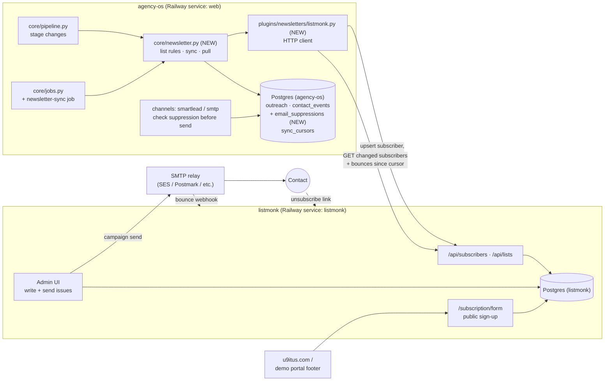
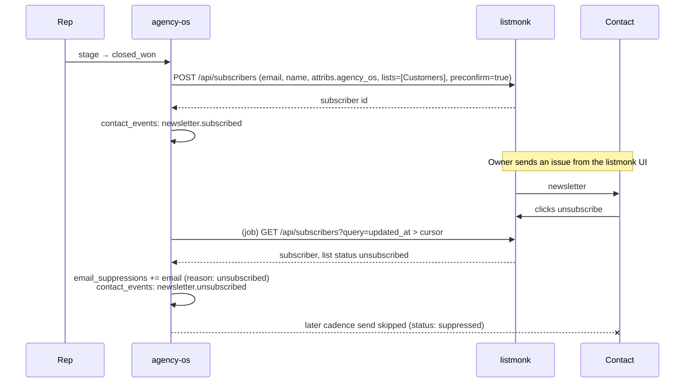

# agency-os ↔ listmonk newsletter integration

Spec for adding a **self-hosted email newsletter system** (listmonk,
https://listmonk.app) as its own Docker service and connecting it to
**agency-os**. Written in the same format as
[U9ITUS_PORTAL_INTEGRATION.md](U9ITUS_PORTAL_INTEGRATION.md): diagrams are
Mermaid, the contract is YAML, and tasks have file paths and acceptance checks.

Status (2026-10-06): **proposed, nothing built yet.** Hosting is decided: listmonk runs
as a separate Railway service from its Docker image (section 5). The billing suggestion
is in section 8, and the open questions are in section 9.

## Goal

agency-os is good at **one-to-one outreach**: cold email, follow-ups, calls, mail.
It has no way to send **one-to-many** mail to people who *asked* to hear from us.
Those people are customers, engaged prospects, and visitors who sign up on
u9itus.com. listmonk fills that gap. It is an open-source newsletter and mailing-list
manager: a single Go binary plus PostgreSQL, run as a Docker image, with a web UI,
templates, double opt-in, bounce handling and a JSON API.

agency-os decides **who** belongs on which list. listmonk handles **sending,
unsubscribes and bounces**. Unsubscribes and bounces flow back into agency-os so that
nobody who opted out of the newsletter keeps getting cold outreach either.

## Use cases

| # | Actor | Scenario | Outcome |
|---|---|---|---|
| UC1 | Sales rep | A prospect reaches `engaged` or later and says "keep me posted" | One click on the prospect page adds the contact to the **Civic Updates** list. listmonk sends a double opt-in email, and the contact is subscribed only after confirming. |
| UC2 | Owner | A deal closes (`closed_won`) | The contact is added to **Customers** automatically, for release notes, election-cycle deadlines and onboarding tips. An existing customer relationship covers this, and it is still unsubscribable. |
| UC3 | Owner | A prospect goes to `closed_lost` or `nurture` | The contact is offered **Civic Updates** (double opt-in), so the cadence stops cleanly and the relationship stays warm until the next cycle. |
| UC4 | Visitor | Someone signs up through a form on u9itus.com or a demo portal | listmonk's public subscription form handles it. agency-os pulls the new subscriber and, if the email matches a prospect contact, records a `newsletter.subscribed` contact event (a warm signal for the rep). |
| UC5 | Contact | Someone clicks "unsubscribe" in a newsletter, or their address hard-bounces | agency-os pulls the change and sets the outreach suppression flag. Cadence sends to that email skip with `suppressed`, and the prospect page shows why. |
| UC6 | Owner | Writing and sending an issue | Done in the listmonk UI (templates, scheduling, A/B subject lines, analytics). agency-os never composes newsletters. |
| UC7 (later) | Any customer (CBO, practice, firm) | A customer of any product wants to email *their own* members or patients | Phase 2: a newsletter account per customer organization, with its own lists, paid through agency-os (section 8). |

**Not a use case:** bulk-loading cold prospects into a newsletter. Cold contacts
stay in campaign cadences (Smartlead/SMTP), which have their own sending
infrastructure and per-message opt-out text. Putting purchased or scraped
addresses on a newsletter list breaks consent rules and would get the sending
domain blocklisted.

## Constraints that shape the design

| Fact | Consequence |
|---|---|
| listmonk needs its own PostgreSQL (12+) and runs as `listmonk/listmonk` on port 9000 | It is a **separate service**: its own container, with its own database or schema, not tables inside the agency-os database. agency-os talks to it only over HTTP. |
| listmonk has **no outgoing webhooks** for unsubscribes or subscriptions; it only accepts incoming bounce webhooks | agency-os **pulls** changes on a schedule, the same pattern as `pull-events` for u9itus (`core/jobs.py`, `sync_cursors`). There is no public webhook endpoint on agency-os. |
| The API authenticates with an API user: `Authorization: token <api_user>:<token>` | Add the env vars `LISTMONK_URL`, `LISTMONK_API_USER`, `LISTMONK_API_TOKEN`. Give the API user a role limited to subscribers and lists (no campaign sending, no settings). |
| agency-os has no unsubscribe or suppression concept today (`prospects.do_not_sell` covers data sales, not email) | Add one (task L4). It applies to **all** email channels, not only listmonk. |
| Contacts live on `outreach` rows (per prospect per campaign), not on `prospects` | Suppression is keyed by **email address**, so one opt-out covers every campaign the address appears in. |
| `core/jobs.py` only runs jobs that are safe to repeat, and sending stays manual | List sync and the unsubscribe pull are idempotent, so they can be jobs. **Sending newsletters stays in the listmonk UI.** |
| Dry runs must never call external APIs (see `enqueue_outreach()`) | Every listmonk write honors `dry_run`. |

## 1. System map



## 2. Lifecycle (one contact)



## 3. List rules

Lists are created once in listmonk and referenced by **listmonk list ID** in
`config.yaml`. listmonk serves every product, so list names start with who owns them:

- **Our lists, per product:** `u9itus: Customers`, `u9itus: Civic Updates`,
  `healthcare: Customers` and so on. A product only gets lists once it has an audience.
- **Customer lists (UC7):** `acct <prospect_id>: <name>`, owned by one newsletter account
  (section 8) and visible only to that customer's listmonk user.

The two lists below are the voter guide's. Another product follows the same rules with
its own pair.

| listmonk list | Type / opt-in | Who gets added | How |
|---|---|---|---|
| `u9itus: Customers` | private, single opt-in | outreach contacts at `closed_won` | Automatic on stage change, `preconfirm_subscriptions: true` |
| `u9itus: Civic Updates` | public, **double opt-in** | contacts at `engaged`+, `closed_lost`, `nurture`, and site sign-ups | Rep clicks "Invite to newsletter" (UC1, UC3), or the public form (UC4). listmonk sends the confirmation email. |

Rules:
- Never add a contact whose email is in `email_suppressions`.
- Never add a contact automatically to a double opt-in list. Only a rep action or the contact's own sign-up does that.
- A stage moving **backwards** never removes anyone from a list. Only the contact can unsubscribe.

## 4. Contract (machine-readable)

```yaml
listmonk:
  base_url: ${LISTMONK_URL}            # e.g. http://listmonk.railway.internal:9000
  auth: "Authorization: token ${LISTMONK_API_USER}:${LISTMONK_API_TOKEN}"
  subscriber_attribs:                  # stored on every subscriber agency-os creates
    agency_os:
      prospect_id: int
      outreach_id: int
      campaign: str
      org_name: str
  calls:
    upsert_subscriber:
      first: GET /api/subscribers?query=subscribers.email='<email>'   # exists?
      create: POST /api/subscribers
        body: {email, name, status: enabled, lists: [list_id], attribs, preconfirm_subscriptions}
      add_to_list: PUT /api/subscribers/lists
        body: {ids: [subscriber_id], action: add, target_list_ids: [list_id], status: confirmed|unconfirmed}
    pull_changes:
      call: GET /api/subscribers?query=subscribers.updated_at > '<cursor_iso>'&order_by=updated_at&order=asc&per_page=100&page=N
      map:
        status == blocklisted                    -> suppress(reason: blocklisted)
        lists[*].subscription_status == unsubscribed (any u9itus list)
                                                 -> suppress(reason: unsubscribed)
        new subscriber, email matches outreach   -> contact_event newsletter.subscribed
    pull_bounces:
      call: GET /api/bounces?per_page=100&order_by=created_at&order=asc
      map: type == hard | complaint              -> suppress(reason: bounced | complaint)
  cursor:
    table: sync_cursors
    product_key: "listmonk:subscribers"   # cursor_value = epoch seconds of last updated_at seen
    product_key_bounces: "listmonk:bounces"  # cursor_value = last bounce id seen
```

New agency-os table:

```sql
CREATE TABLE IF NOT EXISTS email_suppressions (
    email CITEXT PRIMARY KEY,
    reason TEXT NOT NULL,          -- unsubscribed | blocklisted | bounced | complaint | manual
    source TEXT NOT NULL,          -- listmonk | smartlead | manual
    created_at TIMESTAMP DEFAULT CURRENT_TIMESTAMP
);
```

## 5. The Docker service

### Local (`docker-compose.listmonk.yml`, NEW)

```yaml
services:
  listmonk-db:
    image: postgres:17-alpine
    environment:
      POSTGRES_USER: listmonk
      POSTGRES_PASSWORD: ${LISTMONK_DB_PASSWORD:-listmonk}
      POSTGRES_DB: listmonk
    volumes: [listmonk-db:/var/lib/postgresql/data]
    healthcheck:
      test: ["CMD-SHELL", "pg_isready -U listmonk"]
      interval: 10s
      retries: 6

  listmonk:
    image: listmonk/listmonk:v6.2.0    # pin a release; upgrade deliberately (back up its DB first)
    depends_on:
      listmonk-db: {condition: service_healthy}
    ports: ["9000:9000"]
    command: [sh, -c, "./listmonk --install --idempotent --yes --config '' && ./listmonk --upgrade --yes --config '' && ./listmonk --config ''"]
    environment:
      LISTMONK_app__address: 0.0.0.0:9000
      LISTMONK_db__host: listmonk-db
      LISTMONK_db__port: 5432
      LISTMONK_db__user: listmonk
      LISTMONK_db__password: ${LISTMONK_DB_PASSWORD:-listmonk}
      LISTMONK_db__database: listmonk
      LISTMONK_db__ssl_mode: disable
      LISTMONK_ADMIN_USER: ${LISTMONK_ADMIN_USER:-admin}         # first run only
      LISTMONK_ADMIN_PASSWORD: ${LISTMONK_ADMIN_PASSWORD:?set it}
      TZ: America/Los_Angeles
    volumes: [listmonk-uploads:/listmonk/uploads]

volumes:
  listmonk-db:
  listmonk-uploads:
```

`docker compose -f docker-compose.listmonk.yml up -d`, then open
http://localhost:9000, create the two lists and an API user (Admin → Users), and put
the IDs and token in `.env`.

### Railway (decided: a separate service in the same project)

listmonk runs as its **own Railway service, deployed from the Docker image**, in the
same project as agency-os (`believable-learning`, environment `production`). As of
2026-10-06 that project has two services, `agency-os` and `Postgres` (18.6);
`listmonk` will be the third (plus its database, below).

```mermaid
flowchart LR
  subgraph RW["Railway project: believable-learning (production)"]
    AOS["agency-os<br/>(repo jhead12/agency-os, Dockerfile)"]
    PG[("Postgres<br/>agency-os data")]
    LM["listmonk<br/>(image listmonk/listmonk:v6.2.0)"]
    LPG[("Postgres-listmonk<br/>listmonk data")]
    VOL[["volume /listmonk/uploads"]]
  end
  AOS --> PG
  AOS -- "private network<br/>listmonk.railway.internal:9000" --> LM
  LM --> LPG
  LM --- VOL
  NET(("Internet: unsubscribe links,<br/>sign-up form, archive")) -- "news.u9itus.com" --> LM
  ```

- A new service **listmonk** from the Docker image `listmonk/listmonk:v6.2.0`, with the same
  start command and `LISTMONK_db__*` variables pointing at a **second Railway Postgres
  service** (`Postgres-listmonk`). Keep it separate from the agency-os database, so a
  listmonk upgrade or restore can't touch CRM data. Set the variables with Railway
  references (`${{Postgres-listmonk.PGHOST}}` and so on), not copied values.
- Upgrades: change the pinned tag, after a backup of `Postgres-listmonk`. The start
  command runs `--upgrade --yes`, so the schema migrates on deploy.
- A volume on `/listmonk/uploads` for template images.
- A public domain such as `news.u9itus.com`, because unsubscribe links, the sign-up form
  and the archive must be public. agency-os reaches it over the private network
  (`http://listmonk.railway.internal:9000`).
- SMTP in listmonk settings: a **transactional relay** (SES or Postmark), *not* the
  Smartlead mailboxes or the cold-outreach domain. Use a subdomain such as
  `news.u9itus.com` with its own SPF/DKIM/DMARC, so newsletter reputation and
  cold-email reputation never mix.
- Point the relay's bounce webhook at listmonk (`/webhooks/service/ses` or the Postmark
  equivalent), and turn on Settings → Bounces → *hard: blocklist after 1, complaint: blocklist after 1*.

## 6. Tasks

| ID | Task | Files | Acceptance check |
|---|---|---|---|
| L1 | Compose file and env docs | `docker-compose.listmonk.yml`, `README.md`, `.env.example` | `docker compose ... up` serves the listmonk UI on :9000, and the install step is idempotent on restart. |
| L2 | listmonk HTTP client: `check_connection()`, `upsert_subscriber()`, `add_to_list()`, `changed_subscribers(since)`, `bounces(after_id)`. Never raises; returns `{ok, error}` like `u9itus_client.py`. | `plugins/newsletters/__init__.py`, `plugins/newsletters/listmonk.py` | Unit tests with a mocked `requests` session cover auth header, pagination, and a 401 and a timeout. |
| L3 | Config and registry: a `newsletter:` block in `config.yaml` (`list_ids.customers`, `list_ids.civic_updates`), and the plugin listed on the Plugins page with a "Test connection" button | `config.yaml`, `core/registry.py`, `web/templates/plugins.html` | Plugins page shows listmonk as configured or not, and the test button reports the listmonk version or the error. |
| L4 | Suppression: `email_suppressions` table, `db.is_suppressed(email)`, a check in the send path so every channel returns `SendResult(status="skipped", error="suppressed: <reason>")` | `core/db.py`, `core/pipeline.py` | A test in which a suppressed email in an enqueued cadence is skipped and logged; non-suppressed emails send as before. |
| L5 | List rules and sync: `core/newsletter.py` with `on_stage_change()` (auto-add to Customers) and `invite(outreach_id)` (Civic Updates, unconfirmed), and a hook in the existing stage-change code. Honors `dry_run`. | `core/newsletter.py`, `core/pipeline.py` | Moving a test outreach to `closed_won` creates exactly one listmonk subscriber, and repeating it does not create a duplicate. A dry run makes no HTTP calls. |
| L6 | Pull job: `pull_newsletter_changes()` reads changed subscribers and bounces after the cursor, writes suppressions and `contact_events` (`newsletter.subscribed`, `newsletter.unsubscribed`, `newsletter.bounced`), then advances the cursors | `core/newsletter.py`, `core/jobs.py` (`Job("newsletter-sync", ..., AGENCY_OS_NEWSLETTER_MINUTES, 60)`) | Running it twice in a row writes nothing new the second time. An unsubscribe made in the listmonk UI shows as a suppression within one job interval. |
| L7 | CLI: `agency_os.py newsletter` with `status`, `invite --outreach N`, `sync`, `suppress --email X`, `unsuppress --email X` | `core/cli.py`, `docs/CLI_REFERENCE.md` | Commands work against local listmonk; `unsuppress` is Owner-only and audited. |
| L8 | UI: an "Invite to newsletter" button and a subscription/suppression badge on the prospect page; a Suppressions admin page | `web/app.py`, `web/templates/prospect_detail.html`, `web/templates/admin_suppressions.html` | The button is hidden when listmonk isn't configured or the email is suppressed. The badge shows the reason and date. |
| L9 | Permissions: `newsletter.invite` (Sales Rep and up) and `newsletter.manage` (Owner: suppressions, unsuppress) | `core/access.py` | Route permission tests pass, and a Viewer gets 403 on invite. |

Suggested order: L1 → L2 → L4 (useful on its own, even before listmonk is live) → L5 → L6 → L3/L7/L8/L9.

## 7. Guardrails

- **Consent first.** Only `closed_won` contacts are added without a confirmation step. Everything else goes through double opt-in. No bulk import of prospect lists into listmonk, from any CLI command or UI.
- **One opt-out stops everything.** An unsubscribe from the newsletter also suppresses cold outreach to that address. It is safer, and it is what a contact expects.
- **Separate sending reputation.** A different subdomain and SMTP relay from the cold-outreach mailboxes.
- **Least privilege.** The listmonk API user can manage subscribers and lists only; it cannot send campaigns or change settings (no `campaigns:send`, a separate permission since listmonk v6.1).
- **No PII beyond what's needed.** Subscriber attribs hold IDs, campaign and org name only: no notes, phone numbers or call logs.
- **Unsuppress is rare and audited.** Only an Owner can lift a suppression, with a reason, through `audit_log`.

## 8. Billing (suggestion)

This section prices **UC7**: customers sending newsletters to *their own* members or
patients. Our own sales lists are a cost of selling and are never billed.

### Why agency-os, not u9itus

listmonk serves **every product** agency-os sells, not just the voter guide.
Campaigns already pick a product (`product: u9itus_voter_guide` or
`product: lead_list` in `campaign.yaml`), and more will follow. If billing lived in
u9itus, a healthcare-practice or recruiting customer would need a u9itus account just to
pay for email. agency-os is the one place that knows every customer, whatever they
bought, and it already sells to outside buyers (the x402 package catalog). So:

| System | Role in billing |
|---|---|
| **agency-os** | Owns billing: newsletter accounts, allowances, the credit balance, Stripe top-ups, the send gate, and settling. Product-neutral. |
| **Products** (u9itus voter guide, lead lists, later ones) | Each says what newsletter allowance its plans include, through an optional method on the product plugin. They hold no billing code. |
| **listmonk** | Counts subscribers and sends. It never sees money. |

The cost of this choice: agency-os needs its own Stripe integration, while u9itus
already has one. Using Stripe's hosted Checkout keeps that small, because agency-os
never shows a card form (task B2).

### What to meter

**Emails sent**, because that's what costs money (the relay charges per email). Show
customers **subscribers** as well, because that's the number they understand. The plan
is set by a subscriber cap, and the email allowance is what's actually counted.

### Who the customer is

A **newsletter account** belongs to a customer organization: a prospect with at least one
`closed_won` outreach, in any campaign and for any product. One organization has one
account and one credit balance, even if it bought two products. Each product purchase
**grants** an allowance into that account.

### Suggested prices

Allowances come from the product. Credits for going over are the same for every product.

| Product and plan | Included per period |
|---|---|
| Voter guide Starter ($500 per cycle) | Not included. **Add-on: $150 per cycle** for up to 1,000 subscribers and 10,000 emails. |
| Voter guide Pro ($1,500 per cycle) | Up to **2,500 subscribers** and **25,000 emails** per cycle. |
| Voter guide Coalition ($4,000 per cycle) | Up to **10,000 subscribers** and **100,000 emails** per cycle, shared across partners, with one list per partner. |
| Lead lists (healthcare, recruiting) | Not included. **Add-on: $50 per month** for up to 1,000 subscribers and 5,000 emails. |
| Over the allowance (any product) | **Prepaid credits: $3 per 1,000 emails**, $25 minimum top-up. |

How the numbers hold up: Amazon SES charges about $0.10 per 1,000 emails, so a full
Coalition allowance costs about $10 to send. Railway adds a few dollars a month for
listmonk and its database. The real costs are support and protecting the shared sending
domain, and the prices carry those. Treat them as a starting point and adjust after the
first period's usage.

### How a paid send works

Customers write newsletters in listmonk at `news.u9itus.com` (see question 2), signed
in with a listmonk user whose role covers **only their own lists** and has
**no `campaigns:send`** permission. Customers don't get an agency-os login, since
agency-os users are staff. Instead, a customer requests a send by adding the tag
**`send`** to the campaign in listmonk, and an agency-os job does the rest:

```mermaid
sequenceDiagram
  participant C as Customer
  participant LM as listmonk
  participant AOS as agency-os (job, every 5 min)
  participant S as Stripe
  C->>LM: writes campaign 42, adds tag "send"
  AOS->>LM: GET /api/campaigns?tags=send → campaign 42, target lists
  AOS->>AOS: account for those lists → estimate = subscriber count<br/>allowance first, then credits
  alt enough balance
    AOS->>AOS: newsletter_sends: reserve
    AOS->>LM: PUT /api/campaigns/42/status {status: running}<br/>tag "send" → "sending"
  else not enough
    AOS->>S: create Checkout Session (top-up)
    AOS->>LM: POST /api/tx → email the customer the Checkout link<br/>tag "send" → "needs-credits"
    C->>S: pays
    AOS->>S: (job) pull checkout.session.completed → add credits
    Note over AOS: next run picks campaign 42 up again
  end
  loop until finished
    AOS->>LM: GET /api/campaigns/42 → status, sent
  end
  AOS->>AOS: settle: charge actual sent, release the rest<br/>tag → "sent"
```

- The reservation is made **before** the send starts, so nobody can send past their
  balance. Settling charges the **actual** `sent` count and releases the rest.
- If listmonk fails to start the send, the reservation is released at once.
- One `newsletter_sends` row per listmonk campaign ID (a unique key), so a retry or a
  re-added tag can't charge twice.
- Stripe payments are **pulled** (`GET /v1/events?type=checkout.session.completed`,
  with a cursor in `sync_cursors`), the same pattern as u9itus portal events, so
  agency-os needs no public webhook endpoint.
- Sends start within one job interval of the tag (5 minutes by default), not instantly.
  If a product later wants an instant Send button (say, in the u9itus portal builder),
  it calls agency-os's API to request the send. The gate stays in agency-os.

### Data (agency-os Postgres)

```sql
-- One per paying customer organization.
CREATE TABLE IF NOT EXISTS newsletter_accounts (
    prospect_id INTEGER PRIMARY KEY REFERENCES prospects(id) ON DELETE CASCADE,
    listmonk_user_id INTEGER,
    list_ids TEXT DEFAULT '[]',            -- listmonk list IDs this account owns
    stripe_customer_id TEXT,
    status TEXT DEFAULT 'active',          -- active | paused
    created_at TIMESTAMP DEFAULT CURRENT_TIMESTAMP
);

-- Append-only: grants, top-ups, reservations, charges, releases, refunds.
-- Balances are sums over this table, taken under an advisory lock per account,
-- the same way core/payments.py reserves campaign budget.
CREATE TABLE IF NOT EXISTS newsletter_ledger (
    id INTEGER GENERATED BY DEFAULT AS IDENTITY PRIMARY KEY,
    prospect_id INTEGER NOT NULL REFERENCES newsletter_accounts(prospect_id),
    kind TEXT NOT NULL,                    -- grant | topup | reserve | charge | release | refund | expire
    emails BIGINT DEFAULT 0,               -- allowance, in emails
    amount_cents BIGINT DEFAULT 0,         -- credit, in cents
    product_key TEXT,                      -- which product granted it, for grants
    ref TEXT,                              -- outreach id, Stripe session id, listmonk campaign id
    expires_at TIMESTAMP,                  -- for grants: end of the cycle or month
    created_at TIMESTAMP DEFAULT CURRENT_TIMESTAMP,
    UNIQUE (kind, ref)
);

CREATE TABLE IF NOT EXISTS newsletter_sends (
    listmonk_campaign_id INTEGER PRIMARY KEY,
    prospect_id INTEGER NOT NULL REFERENCES newsletter_accounts(prospect_id),
    estimated BIGINT NOT NULL,
    sent BIGINT,
    status TEXT NOT NULL,                  -- reserved | running | settled | released
    created_at TIMESTAMP DEFAULT CURRENT_TIMESTAMP,
    settled_at TIMESTAMP
);
```

Product plugins get one optional method, used only when present (like the optional
extras on `DemoPortalProduct`):

```python
def newsletter_allowance(self, plan: str) -> dict | None:
    """{"subscribers": int, "emails": int, "period": "cycle" | "month"} or None."""
```

### Upgrade signals

Because billing lives in agency-os, these are ordinary agency-os events. No product
has to report them:

- `newsletter.sent`, with the count, in the account's activity log.
- `newsletter.allowance_low`, once at 80% of a period's allowance. It sets a follow-up
  for the account's rep: suggest the next plan or a top-up.

### Billing guardrails

- **Consent is a condition of use.** Before each import, the customer confirms that the
  members agreed to receive email. agency-os records the confirmation with the account.
- **Automatic pause.** If an account's complaint rate goes over 0.3% or its hard bounces
  over 5% on one send, the account is paused until we review it. Pausing never charges.
  It protects the domain every customer shares.
- **Refunds.** Unused prepaid credits are refundable, through a Stripe refund against the
  top-up's payment. The included allowance is not.
- **Our own lists are never billed.** Sends to lists not owned by any account (our sales
  lists) skip the gate. Only our own staff can send those, from the listmonk admin.
- **Money moves only through the ledger.** No code updates a balance column, and every
  entry has a unique `(kind, ref)`, so a retried job can't double-grant or double-charge.

### Billing tasks (all in agency-os unless noted)

| ID | Task | Files | Acceptance check |
|---|---|---|---|
| B1 | Tables and ledger: the three tables, balance by summing, reserve under an advisory lock | `core/db.py`, `core/newsletter_billing.py` | Concurrent reservations never take an account below zero. Repeating any entry with the same `(kind, ref)` is a no-op. |
| B2 | Stripe top-ups: create a Checkout Session, pull `checkout.session.completed` with a cursor, write `topup` entries. `stripe` goes in a new optional `requirements-billing.txt` with a `WITH_BILLING` Docker build arg, like the existing optional extras | `core/stripe_billing.py`, `requirements-billing.txt`, `Dockerfile` | A test-mode payment adds credits once, even if the pull runs twice. Without Stripe keys, billing shows as not configured and nothing crashes. |
| B3 | Product allowances: the optional `newsletter_allowance()`, implemented for the voter guide, and a `grant` entry when an outreach reaches `closed_won` | `core/protocols.py`, `plugins/products/u9itus_voter_guide.py`, `core/pipeline.py` | Closing a Pro deal grants 25,000 emails that expire at the end of the cycle. Closing it twice grants once. |
| B4 | Send gate job: find tagged campaigns, reserve, start, or send a top-up link | `core/newsletter_billing.py`, `core/jobs.py` (`Job("newsletter-send", ..., AGENCY_OS_NEWSLETTER_SEND_MINUTES, 5)`) | Tagging a campaign twice creates one send. Insufficient balance doesn't start the campaign and emails one Checkout link. |
| B5 | Settle job: charge the actual `sent`, release the rest, emit `newsletter.sent` and `newsletter.allowance_low` | `core/newsletter_billing.py`, `core/jobs.py` | Settling twice charges once. The 80% event is emitted once per period. |
| B6 | Account setup and admin: create the listmonk user and lists for an account, a billing panel on the prospect page (allowance, credits, sends), an Owner page for pauses and refunds, and a `billing.manage` permission | `web/app.py`, `web/templates/prospect_detail.html`, `web/templates/admin_newsletter_billing.html`, `core/access.py` | A rep can see the balance. Only an Owner can pause, unpause, refund or grant credits by hand, and each action is audited. |

Billing is phase 2. Build it after L1–L9, once our own newsletter has run for a cycle.

## 9. Open questions (owner)

1. **SMTP relay:** Amazon SES (cheapest, more setup) or Postmark (simpler, has a broadcast stream)?
2. **Sending domain:** is `news.u9itus.com` acceptable for both the listmonk UI/public pages and the From address?
3. ~~**listmonk hosting**~~ Decided: a separate Railway service from the Docker image, in the agency-os project. Its database is a second Railway Postgres service (section 5).
4. **Billing numbers:** are the section 8 allowances and prices right? Is the newsletter included in voter guide Pro and Coalition, or an add-on everywhere? Is $50 a month right for lead-list customers?
5. **Customer access:** are customers OK writing newsletters in listmonk's own interface (listmonk branding) and requesting sends with a tag? A branded editor and Send button would be much more work.
6. **Suppression scope:** should a newsletter unsubscribe also stop *manual* channels (calls, direct mail), or only email?
