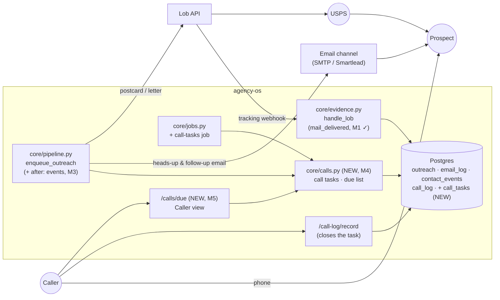
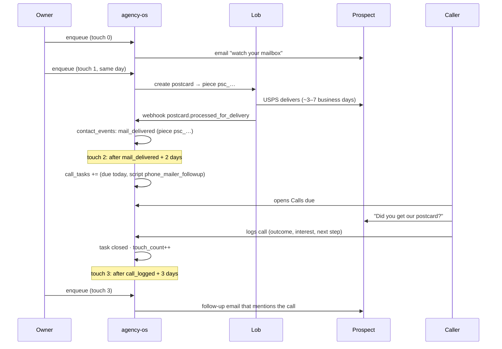

# Mailer + email + call cadence ("mail, then call")

Spec for running **Lob mailers, cadence email and phone calls as one
coordinated sequence**. The core rule: when a postcard or letter reaches
someone, that person goes on the callers' list a couple of days later, with a
script that refers to the mailer. Written in the same format as
[LISTMONK_INTEGRATION.md](LISTMONK_INTEGRATION.md): diagrams are Mermaid, the
contract is YAML, and tasks have file paths and acceptance checks.

Status (2026-10-06): **M1 built** (Lob delivery scans are recorded). M2–M7 are
proposed. The open questions are in section 8.

## Goal

Direct mail works best when it's followed up quickly by a phone call ("Did you
get the postcard we sent about your voter guide?"). Today agency-os can send
email, send Lob mail and log calls, but each is separate:

- The cadence sends **one channel per touch**, chosen as the first configured
  channel that can reach the person ([core/pipeline.py](../core/pipeline.py),
  `enqueue_outreach`).
- The Lob webhook recorded only **returned** mail, so nothing knew when a mailer
  actually arrived.
- Calls are logged after the fact ([/call-log](../web/app.py)). Nothing tells a
  caller who to call next or why.

This spec adds the missing pieces: delivery tracking (built), a **calls-due list**
for callers, and cadence steps that **wait for an event** (mail delivered, call
logged) instead of only a fixed number of days.

**Terminology.** In agency-os, a *Workflow* is a replay that the in-browser player
acts out on a person's own screen ([core/workflows.py](../core/workflows.py)). It
never runs in the background. This feature extends the **campaign cadence**
instead. A Workflow tutorial ("Work your calls-due list") is a good companion,
but it isn't the engine.

## Use cases

| # | Actor | Scenario | Outcome |
|---|---|---|---|
| UC1 | Owner | Sets up a campaign: email heads-up → postcard → call when it lands → follow-up email | One `cadence` in `campaign.yaml` covers all three channels. No separate tools are needed. |
| UC2 | System | Lob reports a piece as processed for delivery | A `mail_delivered` contact event is recorded on the prospect, once per piece. **(Built: M1)** |
| UC3 | Caller | Opens **Calls due** | Sees everyone whose mailer landed at least N days ago, oldest first, with the campaign, the script to use and the mailer's front image or headline. Calls them, logs the outcome, and they leave the list. |
| UC4 | System | Lob never sends a delivered scan (it isn't guaranteed) | After a fallback delay (default 10 days after sending), the call step comes due anyway, marked "delivery not confirmed". |
| UC5 | System | Mail comes back returned-to-sender | No call is created for that address; the existing `mail_returned` evidence flow applies, and the prospect page prompts for a new address. |
| UC6 | Sales rep | A call is logged | The next cadence step (for example a "following up on our call" email) becomes due after its delay. If the call outcome is `not_interested` or `do_not_call`, the sequence stops. |
| UC7 (later) | Owner | A contact who engaged on the call says "keep me posted" | Handled by the Listmonk spec (UC1 there): invite to Civic Updates. Cold contacts are never bulk-added to a newsletter list. |

## Constraints that shape the design

| Fact | Consequence |
|---|---|
| Lob has no proof of delivery for standard mail; it reports USPS scans (`in_transit`, `in_local_area`, `processed_for_delivery`, sometimes `delivered`, `re-routed`, `returned_to_sender`). | `processed_for_delivery` (the out-for-delivery scan) or `delivered`, whichever comes first, counts as delivered. A fallback delay covers pieces with no scan (UC4). |
| Lob piece IDs are already stored as `email_log.provider_message_id` when the Lob channel sends. | Webhook events can be matched to the prospect and campaign without a new table (M1 uses this). |
| `core/jobs.py` only automates actions that are safe to repeat; sending stays manual. | Creating call tasks is idempotent, so it can run as a job. **Lob and email sends stay a deliberate `enqueue` run**, because they cost money and reach real people. |
| The cadence advances by `touch_count` and `next_follow_up_at`. | Waiting on an event is a check before a due step runs: if the event hasn't happened yet, the step is skipped without advancing, the same way an unreachable contact is treated today. |
| `enqueue_outreach` skips anyone with no email **and** no phone, before choosing a channel. | Lob-only contacts (an address but no email or phone) are never mailed today. M2 fixes this. |
| Each Lob piece costs money, on one shared Lob account. | **Decided (Q1):** only a Super Admin can turn `lob_direct_mail` on or off for a campaign (`access.SUPER_ADMIN_CHANNELS`), until the costs and liabilities are understood. |

## 1. System map



## 2. Lifecycle (one prospect)



## 3. Cadence rules

A cadence step gains two optional fields:

| Field | Meaning |
|---|---|
| `after: mail_delivered` | The step comes due `delay_days` after this prospect's most recent mailer in this campaign was delivered. If no delivery is recorded, it comes due `fallback_days` after the mailer was **sent**. |
| `after: call_logged` | The step comes due `delay_days` after a call is logged for this outreach following the previous touch. No fallback: if nobody calls, the sequence waits (and the call shows as overdue). |
| `fallback_days` | Only with `after: mail_delivered`. Default 10. |

And one new channel:

| Channel | Meaning |
|---|---|
| `call` | Doesn't send anything. It creates an open **call task** for the outreach with the step's script, then the touch counts as done once the call is logged (not when the task is created). |

Rules:
- A step's `delay_days` still sets `next_follow_up_at`. `after:` only adds a condition; it never makes a step due earlier.
- **Returned mail stops the mail branch.** If the latest mailer has a `mail_returned` event, a `call` step after it is still created (the phone may work), but it's labeled "mail returned"; a later mail step is skipped until the address is updated.
- **A call outcome can end the sequence.** Outcomes `not_interested`, `do_not_call` and `wrong_number` move the outreach to `closed_lost` (or `nurture`, per Q4), and no further steps are sent.
- **One open task per outreach.** Creating a task when one is already open does nothing.
- A step's `channels` list stays an ordered fallback: `[call, email_smtp]` means "call if there's a phone number, otherwise email".

## 4. Contract (machine-readable)

```yaml
# campaigns/<slug>/campaign.yaml
cadence:
- touch: 0
  delay_days: 0
  script: 00_mailer_heads_up          # email: "we sent you something"
  channels: [email_smtp]
- touch: 1
  delay_days: 0
  script: mail_00_postcard_cold
  channels: [lob_direct_mail]
- touch: 2
  after: mail_delivered
  delay_days: 2
  fallback_days: 10
  script: phone_mailer_followup       # scripts/phone_*.yaml, shown to the caller
  channels: [call, email_smtp]        # no phone → email instead
- touch: 3
  after: call_logged
  delay_days: 3
  script: 04_after_call
  channels: [email_smtp]
```

```yaml
lob_webhook:
  endpoint: POST /webhooks/lob        # existing; signed with LOB_WEBHOOK_SECRET
  subscribe_in_lob_dashboard:         # Settings → Webhooks, for each piece type you send
    - postcard.processed_for_delivery
    - postcard.delivered
    - postcard.returned_to_sender
    - letter.processed_for_delivery
    - letter.delivered
    - letter.returned_to_sender
  maps_to:
    "*.processed_for_delivery | *.delivered": contact_events.kind = mail_delivered   # once per piece (M1 ✓)
    "*.returned_to_sender":                   contact_events.kind = mail_returned    # existing
    "*.return_envelope.*":                    ignored
  contact_event_detail: {source: lob, event_id, piece_id, event_type}
```

New table (M4):

```sql
CREATE TABLE IF NOT EXISTS call_tasks (
    id INTEGER GENERATED BY DEFAULT AS IDENTITY PRIMARY KEY,
    outreach_id INTEGER NOT NULL REFERENCES outreach(id) ON DELETE CASCADE,
    campaign_id INTEGER NOT NULL REFERENCES campaigns(id) ON DELETE CASCADE,
    touch INTEGER NOT NULL,              -- the cadence touch that created it
    script_key TEXT NOT NULL,
    reason TEXT NOT NULL,                -- mail_delivered | mail_unconfirmed | mail_returned | manual
    due_at TIMESTAMP NOT NULL,
    assigned_to INTEGER REFERENCES users(id) ON DELETE SET NULL,
    call_log_id INTEGER REFERENCES call_log(id) ON DELETE SET NULL,
    done_at TIMESTAMP,
    created_at TIMESTAMP DEFAULT CURRENT_TIMESTAMP
);
-- At most one open task per outreach
CREATE UNIQUE INDEX IF NOT EXISTS idx_call_tasks_open ON call_tasks(outreach_id) WHERE done_at IS NULL;
```

## 5. Setup

1. In the Lob dashboard (Settings → Webhooks), point a webhook at
   `https://<dashboard>/webhooks/lob` and subscribe to the events listed in section 4.
   Copy its secret into `LOB_WEBHOOK_SECRET`. Until that's set the endpoint returns 404.
2. Add a mailer follow-up call script (`scripts/phone_mailer_followup.yaml`) and a
   heads-up email script to the campaign.
3. Give each campaign that mails an explicit per-step `channels` list. Without one, a
   touch uses the first configured campaign channel, which is usually email, so the
   Lob channel never runs.
4. For the call-task job: `AGENCY_OS_RUN_JOBS=1`, with an optional
   `AGENCY_OS_CALL_TASKS_MINUTES` (default 30).

## 6. Tasks

| ID | Task | Files | Acceptance check |
|---|---|---|---|
| M1 ✓ | Record Lob delivery: `processed_for_delivery` / `delivered` → `mail_delivered` contact event, once per piece; return envelopes ignored | `core/evidence.py`, `core/verify.py` (`EVENT_KINDS`), `tests/test_evidence.py` | **Done.** In transit / in local area record nothing; the first delivered scan records one event; a second scan or a replay records nothing. |
| M2 | Let Lob-only contacts be mailed: move the "no email or phone" check after channel selection, so a contact with only a mailing address can still get a `lob_direct_mail` touch | `core/pipeline.py` | Test: an outreach with an address but no email or phone gets the Lob step, and still counts as `no_contact` for an email-only step. |
| M3 | Cadence `after:` and `fallback_days`: parse in `CadenceStep`; in `enqueue_outreach`, skip a due step whose event hasn't happened (no touch advance) | `core/campaign.py`, `core/pipeline.py` | Tests: step waits until `mail_delivered` + delay; falls back after `fallback_days` from the send; `call_logged` waits until a call is logged after the previous touch. |
| M4 | Call tasks: `call_tasks` table; a `call` channel in the pipeline that creates the task instead of sending; `/call-log/record` closes the open task and advances the touch; outcome rules (`not_interested` etc. end the sequence) | `core/db.py`, `core/calls.py` (NEW), `core/pipeline.py`, `web/app.py` | Tests: creating twice leaves one open task; logging a call closes it and increments `touch_count`; `do_not_call` moves the outreach to `closed_lost`. |
| M5 | **Calls due** page: open tasks due now, filtered to campaigns the caller can see (`visible_campaigns`), oldest first; shows reason (delivered / unconfirmed / returned), mailer headline or Lob thumbnail, phone, and a "Log call" form with the task's script open | `web/app.py`, `web/templates/calls_due.html`, `core/access.py` (`GET /calls/due`: `calls.log`) | Route permission tests pass; a Caller sees only tasks for campaigns they can see; a Viewer gets 403. |
| M6 | Call-task job: creates due call tasks without an `enqueue` run (idempotent), so callers' lists fill on their own | `core/jobs.py` (`Job("call-tasks", ..., AGENCY_OS_CALL_TASKS_MINUTES, 30)`) | Running the job twice creates nothing new the second time. It never sends email or mail. |
| M7 | Timeline and tutorial: show `mail_delivered` / `mail_returned` / call tasks on the prospect page; add a "Work your calls-due list" Workflow tutorial | `web/templates/prospect_detail.html`, `workflows/tutorials/calls_due.yaml` | The prospect page shows "Mailer delivered Oct 9" and any open call task; the tutorial plays for a Caller. |

Suggested order: M1 ✓ → M2 → M4 → M5 (a usable manual calls-due list, fed by
`call` steps) → M3 → M6 → M7.

## 7. Guardrails

- **Sends stay manual.** Jobs create call tasks only. Lob and email still go out on a
  deliberate `enqueue` run, and dry runs never call Lob.
- **Lob spend is controlled.** Only a Super Admin can add or remove `lob_direct_mail`
  on a campaign (built; enforced on campaign create and update, and locked in the
  form for everyone else). Per-step `channels` make it explicit which touch costs money.
- **Callers see only their campaigns.** The calls-due list uses the same
  `sees_campaign` rule as every other campaign page.
- **Respect "stop".** `do_not_call` and `not_interested` end the sequence for that
  outreach; returned mail blocks further mail to that address.
- **No new PII.** Call tasks reference outreach and scripts; notes stay in `call_log`.
- **Webhooks are authenticated.** `/webhooks/lob` checks Lob's HMAC signature and
  refuses events older than 5 minutes (existing behavior).

## 8. Open questions (owner)

1. ~~**Lob permission:**~~ **Decided 2026-10-06:** Super Admin only, since there's one
   shared Lob API account, until the liabilities are understood. Revisit before
   offering Lob to Owners (a `mail.send` permission is the likely shape).
2. **Call timing:** call 2 days after delivery (the default here), or the same day?
3. **Assignment:** should call tasks be assigned to a specific caller (round-robin or
   campaign owner), or be a shared queue anyone in the campaign can take?
4. **After "not interested":** `closed_lost`, or `nurture` (eligible for a later
   cycle and, per the Listmonk spec, a newsletter invitation)?
5. **Mailer preview:** show Lob's rendered thumbnail on the calls-due page (an extra
   Lob API call per piece, cached), or only the script's headline text?
