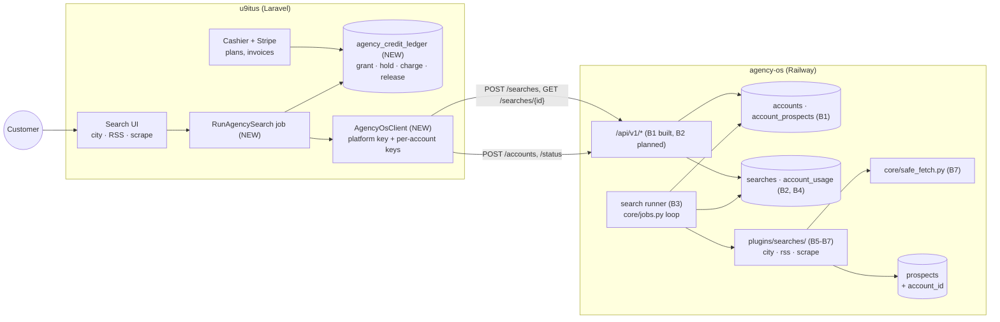

# Paid prospect searches: u9itus bills, agency-os searches

Spec for letting **u9itus** (`/Volumes/PRO-BLADE/Github/u9itus.dev`, Laravel)
charge its customers to find prospects with **agency-os** (this repo,
Python/PostgreSQL/FastAPI). Customers can search three ways: **by city**, **from
an RSS feed**, and **by scraping a list page**. Like
[U9ITUS_PORTAL_INTEGRATION.md](U9ITUS_PORTAL_INTEGRATION.md), it's written for a
coding agent: diagrams are Mermaid, the contract is YAML, and tasks have file
paths and acceptance checks.

Status (2026-10-07):
- **B1 built** on agency-os branch `feat/u9itus-billing-accounts`: accounts, the
  platform and account keys, the account endpoints, and keeping account
  prospects out of house views. Tests: `tests/test_accounts.py` (11).
- **B2 built** on the same branch: the `searches` and `search_results` tables,
  create / get / cancel, and `?search=` on `/api/v1/prospects`.
  Tests: `tests/test_searches.py` (18).
- **B3 and B5 built** on the same branch: the search runner and the `city` search
  (OpenStreetMap through Overpass, until decision 8.1 is made). Tests:
  `tests/test_search_runner.py` (15).
- Everything else is planned. Decisions still open for the owner are in section 8.

## Goal

A u9itus customer buys a plan, types "dentists in Austin, TX" (or pastes a feed
URL or a directory page), and gets a list of prospects. u9itus takes the money
and keeps track of credits. agency-os runs the search, never delivers more than
was paid for, and reports exactly what it delivered so u9itus charges only for that.

## Constraints that shape the design

| Fact | Consequence |
|---|---|
| u9itus is Laravel and already has customers, logins and a portal UI | **u9itus does billing** (Laravel Cashier and Stripe) and the customer UI. agency-os has no payment code for this, and customers never sign in to agency-os. |
| agency-os was single-team: no account or tenant id anywhere | B1 adds **accounts**. A prospect an account's search finds is linked to that account, and **house views never show it** (`Database.hidden_clause`). |
| The portal integration already uses a shared secret stored only as a hash (`AGENCY_OS_AGENCY_TOKEN_HASH` on u9itus) | Same pattern in reverse: u9itus holds a **platform key**, and agency-os stores only its hash (`AGENCY_OS_PLATFORM_KEY_HASH`). |
| agency-os is public on Railway (`agency-os-production-759a.up.railway.app`); u9itus may run queue workers | u9itus **calls** agency-os and **polls** for results. agency-os needs no webhook to u9itus and no signing. |
| Searches take seconds to minutes and can hit paid APIs | Searches are **asynchronous jobs** with a hard `max_results`. u9itus **holds** credits for `max_results` up front, then **charges** what was delivered and **releases** the rest. That's the reserve-then-settle pattern in `core/payments.py`. |
| Scrape and RSS URLs come from customers and are fetched from our server | Every fetch goes through one guarded fetcher (SSRF, robots.txt, rate limits). See section 7. |

## 1. System map



## 2. Lifecycle (one search)

```mermaid
sequenceDiagram
  autonumber
  participant C as Customer
  participant U as u9itus
  participant A as agency-os

  Note over U,A: once, when the subscription starts
  U->>A: POST /api/v1/accounts {external_ref, name} (platform key)
  A-->>U: 201 {account, key}; u9itus stores the key encrypted

  C->>U: search "dentists" in Austin, TX, up to 200
  U->>U: hold 200 × price credits (ledger: hold); refuse if balance too low
  U->>A: POST /api/v1/searches {type: city, params, max_results: 200, idempotency_key}
  A-->>U: 202 {search: {id, status: queued}}
  loop every 15-30 s, up to 1 h
    U->>A: GET /api/v1/searches/{id}
    A-->>U: {status: running | done | failed, delivered, usage}
  end
  U->>U: charge delivered × price, release the rest (ledger: charge + release)
  U->>A: GET /api/v1/prospects?search={id}&after=… (pages)
  U-->>C: results table, CSV export
```

If the job never finishes (timeout, failed), u9itus releases the whole hold. A
failed search charges for what it delivered before failing.

## 3. Contract (machine-readable)

```yaml
base_url: ${AGENCY_OS_BASE_URL}          # e.g. https://agency-os-production-759a.up.railway.app
auth:
  platform: "Authorization: Bearer aos_plat_…"   # u9itus only; hash in AGENCY_OS_PLATFORM_KEY_HASH
  account:  "Authorization: Bearer aos_acct_…"   # one per customer; hash in accounts.key_hash
errors:                                  # every error body: {error: <code>, message: <text>}
  401: unauthorized                      # missing or wrong key
  403: account_suspended
  404: not_found
  409: conflict                          # idempotency_key reused with different settings
  422: invalid
  429: limit_reached                     # planned: an account cap (section 5)
  503: service_not_configured            # platform key hash not set

endpoints:
  # ── Built (B1) ──────────────────────────────────────────────
  - POST /api/v1/accounts:               # platform key
      body: {external_ref: "org_42", name: "Acme Realty"}   # external_ref: [A-Za-z0-9._:-]{1,64}
      201: {account: Account, key: "aos_acct_…"}            # key shown once
      200: {account: Account}                               # already exists: no key (idempotent)
  - POST /api/v1/accounts/{external_ref}/key:    # platform key; old key stops working at once
      200: {key: "aos_acct_…"}
  - POST /api/v1/accounts/{external_ref}/status: # platform key
      body: {status: active | suspended}
      200: {account: Account}
  - GET /api/v1/account:                 # account key
      200: {account: Account}
  - GET /api/v1/prospects?after=0&limit=50:      # account key; limit ≤ 200; id order
      200: {prospects: [Prospect], next_after: int | null}
      "&search={id}": only what that search found, including prospects the account
                      already had (listed, not billed); 404 if not the account's search

  # ── Built (B2) ──────────────────────────────────────────────
  - POST /api/v1/searches:               # account key
      body:
        type: city | rss | scrape
        params: {}                       # per type, section 4
        max_results: 1..500              # hard ceiling on delivered prospects
        idempotency_key: "u9-search-8812"  # unique per account; a retry returns the same search
      202: {search: Search}              # created
      200: {search: Search}              # retry with the same key and settings
      409: conflict                      # same key, different type / params / max_results
  - GET /api/v1/searches/{id}:           # account key; only that account's searches
      200: {search: Search}
  - POST /api/v1/searches/{id}/cancel:   # account key; queued → canceled now,
      200: {search: Search}              # running → cancel_requested, stops after the current page

  # ── Planned (B4) ────────────────────────────────────────────
  - GET /api/v1/usage?from=2026-10-01&to=2026-10-31:  # platform key, all accounts; or account key, own
      200: {usage: [{external_ref, day, searches, delivered, pages_fetched, cost_cents}]}

types:
  Account: {external_ref, name, status, key_hint, created_at, last_used_at}
  Prospect: {id, name, website_url, address, city, state, zip, county, focus_area,
             source, source_url, added_at}
  Search:
    id: int
    type: city | rss | scrape
    params: {}
    status: queued | running | done | failed | canceled
    max_results: int
    delivered: int                       # THE billable number (section 5)
    usage: {pages_fetched: int, api_requests: int, cost_cents: int}   # our cost, for margins
    error: string | null
    cancel_requested: bool
    idempotency_key: string
    created_at, started_at, finished_at: timestamp | null
```

## 4. Search types

Each type is a plugin in a new folder, `plugins/searches/`. These are separate from
`plugins/prospect_sources/` because those are driven by campaign YAML, while
searches take a customer's parameters and are billed. Each plugin declares:

```python
class Search(Protocol):
    name: str                       # "city", "rss", "scrape"
    def validate(self, params: dict) -> dict: ...        # cleaned params, or raises ValueError (→ 422)
    def run(self, params: dict, ctx: SearchContext) -> Iterator[Prospect]: ...
    # ctx.fetch (safe_fetch), ctx.budget (SourceBudget), ctx.remaining (results left), ctx.cancelled()
```

The runner stops pulling from `run()` once `max_results` new prospects are saved,
so a plugin can't over-deliver.

| Type | Params | Where the data comes from | Notes |
|---|---|---|---|
| `city` ✅ | `city`, `state` (two-letter US code), `query` (e.g. "dentist") | **Built on OpenStreetMap through Overpass** (free, no key; one request per search). `query` matches OSM category tags (amenity, shop, office, craft, healthcare), plus names containing it. Google Places is still open (8.1) | `external_ref` = the OSM element (`node/123`), so repeat searches dedupe. Only letters, digits and a few punctuation marks reach the Overpass query. US cities only for now. |
| `rss` | `feed_url`, optional `keywords`, `since` | The feed's items: each item's link and title, plus organization names and sites found in the item | Optional AI extraction through `core/llm.py` counts toward `usage`. A recurring "watch this feed" mode is a later version. |
| `scrape` | `url`, `item_selector`, `fields` (`name`, `website`, `city`, … → CSS selector), optional `next_selector`, `max_pages` ≤ 20 | One list page and its "next" pages on the **same host** | Uses the selectolax parser already used by `plugins/enrichers/local_scraper.py`. Checks robots.txt and fetches at most 1 request/s per host. |

Results are organizations, not people. Searches don't collect personal emails or
phone numbers of individuals (section 7).

## 5. Metering, credits and limits

**What's billable:** `Search.delivered`, the number of prospects this search
**newly** linked to the account. A prospect the account already had isn't billed
again, so re-running a search is cheap for the customer. agency-os computes it.
u9itus never counts rows itself.

**In u9itus:** an append-only `agency_credit_ledger` (`account_id`, `kind` grant
/ hold / charge / release / refund, `credits`, `search_id`, `stripe_ref`). The
balance is the sum. A plan grants credits each billing period. Overage is either
blocked or billed as Stripe metered usage (**owner decision 8.2**). Example only,
not decided:

```yaml
pricing_example:
  credits_per_prospect: {city: 1, rss: 1, scrape: 2}
  plans:
    starter: {usd_month: 49,  credits: 500}
    growth:  {usd_month: 149, credits: 2000}
  overage_usd_per_credit: 0.10
```

Price above our cost. `usage.cost_cents` per search, and `GET /api/v1/usage`,
show the real cost per type so margins can be checked.

**In agency-os** (defense in depth, in case of a bug in u9itus):
- `max_results` ≤ 500 per search, and at most 2 searches `running` per account.
- A daily cap on delivered prospects per account (env `AGENCY_OS_ACCOUNT_DAILY_PROSPECTS`,
  default 2000). Over it, the API answers `429 limit_reached`.
- The existing per-source `SourceBudget` caps on what *we* spend on paid APIs,
  across all accounts.

## 6. Tasks

### agency-os (this repo)

| # | Task | Files | Acceptance |
|---|---|---|---|
| **B1 ✅** | Accounts, platform and account keys, account endpoints, account prospects kept out of house views | `core/accounts.py`, `core/db.py` (schema, `hidden_clause`, `upsert_prospect(account_id=)`), `core/access.py`, `web/app.py`, `core/cli.py` (`agency-os accounts …`) | `tests/test_accounts.py`: keys, idempotent create, rotate, suspend, paging, isolation between accounts, house never sees account prospects, an account never overwrites a house prospect |
| **B2 ✅** | `searches` and `search_results` tables and endpoints: create (idempotent per account), get, cancel; `?search=` on `/prospects` | `core/searches.py`, `core/db.py`, `web/app.py`, `core/access.py` | `tests/test_searches.py`: same `idempotency_key` twice gives one search; different settings → 409; another account's search is 404; `searches.save_result` bills only prospects new to the account and never passes `max_results` |
| **B3 ✅** | Runner: claims `queued` searches (`FOR UPDATE SKIP LOCKED`, at most 2 running per account, active accounts only), runs the plugin, saves through `searches.save_result`, stops at `max_results`, honors cancel, records `delivered` and `usage`. Its own loop every 5 s (`AGENCY_OS_RUN_SEARCHES=1`), not the 5-minute job schedule; `agency-os searches run` runs the queue once. Create validates params with the type's plugin, and refuses types with no plugin (422). | `core/searches.py`, `core/registry.py` (`plugins/searches/`), `web/app.py` (lifespan), `core/cli.py` | `tests/test_search_runner.py`: stops at `max_results`; a plugin `ValueError` fails the search with its message, anything else with a plain one (details in the log); cancel mid-run; a search with no heartbeat for 10 minutes is failed, never run twice |
| B4 | `account_usage` per account per day, `GET /api/v1/usage`, per-account caps (section 5) | `core/searches.py`, `core/db.py` | Usage totals equal the sum of searches; the cap returns 429 and doesn't create the search |
| **B5 ✅** | `city` search (Overpass) | `plugins/searches/city.py` | Faked Overpass responses, no network; unnamed places skipped; found again → not billed again; busy (429), empty and broken answers each fail with a clear message |
| B6 | `rss` search | `plugins/searches/rss.py` | RSS 2.0 and Atom fixtures; `keywords` filter; malformed feed → `failed` with a clear message |
| B7 | `scrape` search and the guarded fetcher | `plugins/searches/scrape.py`, `core/safe_fetch.py` | Refuses private, loopback, link-local and metadata IPs, **including after redirects and DNS changes**; honors robots.txt; stays on the start host; ≤ 1 request/s per host; 2 MB and 15 s limits per page |
| B8 | Team → Accounts page for Owners: accounts, usage, suspend, rotate key | `web/templates/admin_accounts.html`, `web/app.py`, `core/access.py` | Owner only; never shows a key except right after it's issued |

### u9itus (the u9itus.dev repo)

| # | Task | Acceptance |
|---|---|---|
| V1 | `AgencyOsClient` (config `services.agency_os.base_url`, `.platform_key`); account keys stored encrypted (`encrypted` cast), server side only | No key in any API response, log or the browser |
| V2 | Cashier and Stripe plans; `agency_credit_ledger`; credits granted on each paid invoice (`invoice.paid` webhook) | Ledger sum = balance; a webhook replayed twice grants once |
| V3 | Subscription lifecycle: active → `POST /accounts`; `past_due` or canceled → `status: suspended`; paid again → `active` | Suspended customers can't start a search; their saved results stay viewable |
| V4 | Search UI: the three types, the credit hold shown before submitting, status, results table, CSV export | A balance too low to cover `max_results` blocks the submit with a clear message |
| V5 | `RunAgencySearch` job: hold → create (with `idempotency_key` = the u9itus search id) → poll → charge `delivered`, release the rest | A job retried after a crash never double-charges or double-creates; a timeout releases the full hold |
| V6 | Nightly reconciliation against `GET /api/v1/usage` | Any mismatch between charged and delivered is reported to staff |

## 7. Guardrails

- **Keys:** the platform key lives only in u9itus env, and its hash only in
  agency-os env. Account keys are stored encrypted in u9itus and as hashes in
  agency-os. Never put them in logs, URLs or the browser. Rotate with
  `agency-os accounts platform-key` / `POST …/key`.
- **SSRF:** RSS and scrape URLs are customer input fetched from our server. Only
  `core/safe_fetch.py` fetches them. It resolves DNS itself and refuses private,
  loopback, link-local and cloud metadata addresses on every hop.
- **Sites' rules:** honor robots.txt, identify ourselves in the User-Agent, rate
  limit per host, and keep a blocklist of sites whose terms forbid scraping. The
  customer agrees in u9itus's terms that they have the right to collect from the
  pages they submit.
- **OpenStreetMap attribution:** city results are ODbL data. u9itus must show
  "© OpenStreetMap contributors" with them and in CSV exports (each prospect's
  `source` is `osm_city`).
- **Organizations, not people:** searches return business details (name, site,
  address, business phone). Don't scrape individuals' personal emails or phone
  numbers (CCPA/GDPR). Customers' outreach must follow CAN-SPAM, and TCPA for calls
  and texts. Say so in u9itus's terms and in the search UI.
- **Fail closed on money:** no hold, no search. agency-os's caps (section 5) hold even
  if u9itus has a bug.
- **Customers' data is theirs** (decision 8.3): agency-os's house dashboard, campaigns
  and lead packages never show or sell a prospect only an account found.

## 8. Decisions (owner, open)

1. **City data provider:** built on Overpass (free, weaker for small businesses).
   Still open: add Google Places (paid, best coverage) as an upgrade or replace
   Overpass with it. Overpass's public servers are shared and have a fair-use
   policy, so if searches grow, run our own instance (`AGENCY_OS_OVERPASS_URL`).
2. **Overage:** block at zero credits, or bill overage through Stripe metered usage.
3. **Data ownership:** built as private: account-only prospects are hidden from the
   house. If the house should be able to use them (for example, to resell), that's a
   terms-of-service change and a one-line change to `hidden_clause`.
4. **Prices and plans:** section 5 is an example only.
5. **Who sees results first:** whether results stream to the customer while a search
   is still running, or appear only when it's `done` (simpler, and matches charging
   at the end).

## 9. Setup

1. Make the platform key: `agency-os accounts platform-key`. It prints the key and
   the hash.
2. agency-os (Railway service variables): `AGENCY_OS_PLATFORM_KEY_HASH=<hash>`.
   Until it's set, the account API answers `503 service_not_configured`.
3. u9itus env: `AGENCY_OS_PLATFORM_KEY=<key>`, `AGENCY_OS_BASE_URL=<agency-os URL>`.
   Share the key through a password manager, never chat or email.
4. agency-os: `AGENCY_OS_RUN_SEARCHES=1` starts the search runner in the web app.
   Without it, searches stay `queued` (run them by hand with `agency-os searches run`).
5. Check: `curl -X POST $AGENCY_OS_BASE_URL/api/v1/accounts -H "Authorization: Bearer $KEY"
   -H 'Content-Type: application/json' -d '{"external_ref":"test_1","name":"Test"}'`
   returns 201 and a key, and `agency-os accounts list` shows it.

Manual account tools (support and testing): `agency-os accounts list | create |
rotate-key | set-status`.
