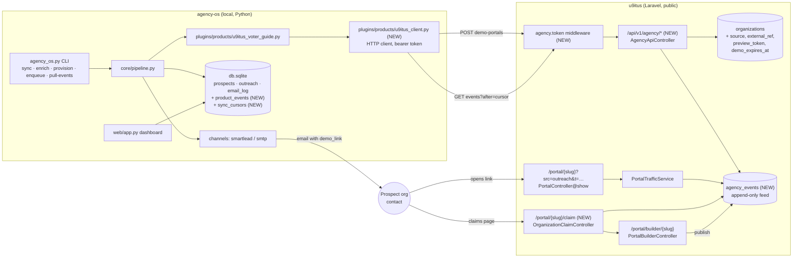
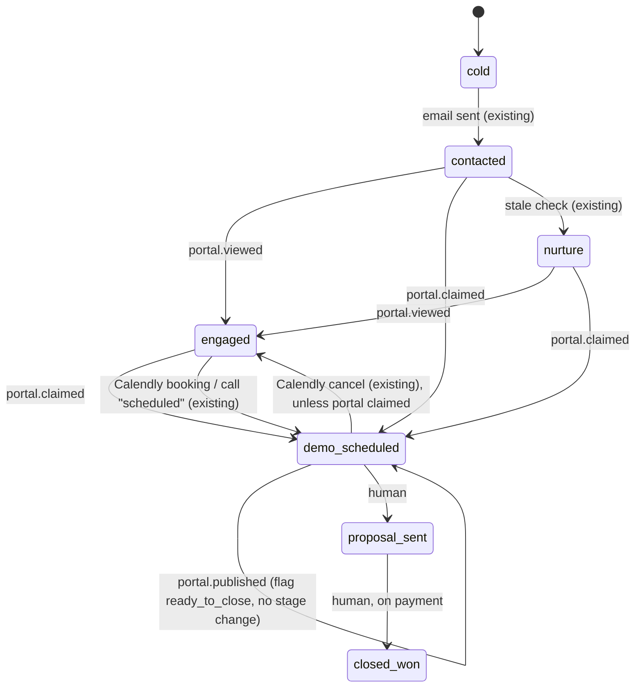

<!-- Copy of u9itus.dev doc/AGENCY_OS_INTEGRATION.md (the u9itus repo copy is the source of truth). -->

# agency-os ↔ u9itus portal integration

Spec for connecting **agency-os** (sales outreach engine, this repo,
Python/SQLite/FastAPI) to the **u9itus white-label portal builder** (`/Volumes/PRO-BLADE/Github/u9itus.dev`,
Laravel). Written for a coding agent implementing it: diagrams are Mermaid, the
contract is YAML, and tasks have file paths and acceptance checks.

Status: **proposal, not built.** Owner decisions recorded 2026-10-02 (section 8).

## Goal

Each prospect in an outreach campaign gets a **personal demo portal**: their
name, their state's ballot measures and candidates, and a "claim this page" link.
agency-os sends the link in its emails, and u9itus reports back when the prospect
views or claims the page. agency-os then advances the pipeline stage without
anyone updating it by hand.

## Constraints that shape the design

| Fact | Consequence |
|---|---|
| agency-os runs on a laptop (`localhost:8000`, `db.sqlite`), not a public server | u9itus **cannot push webhooks** to it. agency-os **pulls** an event feed on a schedule. |
| `Pipeline._build_variables()` calls `product.generate_demo_link()` *before* the `dry_run` check in `enqueue_outreach()` (`core/pipeline.py`) | Provisioning must **not** happen inside `generate_demo_link()`. It needs its own step, and dry runs must never call the API. |
| u9itus `organizations` already has `claim_email`, `claim_token`, `claim_requested_at`; politicians have a working claim flow (`ProfileClaimController`) | Org claiming reuses that pattern. Don't invent a new one. |
| Portal traffic is counted per `?src=` tag with no cookies or stored IPs (`PortalTrafficService`) | Demo views reuse it. Add the source `outreach`, and don't add per-person tracking pixels. |
| Prospects are real organizations | A demo page must never state positions or endorsements they didn't make, must be labeled as a sample, must stay out of search engines, and must expire. |

## 1. System map



## 2. Lifecycle (one prospect)

```mermaid
sequenceDiagram
  autonumber
  participant A as agency-os
  participant U as u9itus API
  participant P as Prospect
  participant W as u9itus portal

  Note over A: daily cron, after enrich, before enqueue
  A->>U: POST /api/v1/agency/demo-portals {external_ref, name, state, ...}
  U-->>A: 201 {slug, demo_url, claim_url, expires_at} (200 if it already exists)
  A->>A: outreach.demo_link = demo_url; prospect.metadata.u9itus = {slug, claim_url}
  A->>P: email touch 1 ({{demo_link}})
  P->>W: GET /portal/{slug}?src=outreach&t={preview_token}
  W->>U: record visit, append event portal.viewed (first view per day)
  Note over A: daily cron
  A->>U: GET /api/v1/agency/events?after={cursor}
  U-->>A: [{id, type: portal.viewed, external_ref, ...}], next_cursor
  A->>A: stage contacted → engaged; log to activity_log
  P->>W: claim page (email verification)
  W->>U: append portal.claimed
  P->>W: edits in builder, publishes
  W->>U: append portal.published
  A->>U: GET events
  A->>A: stage → demo_scheduled (claimed); flag "ready to close" (published)
```

## 3. Pipeline stage mapping

Events only move a prospect **forward**, never backward, and never out of
`closed_won`/`closed_lost`. `closed_won` is always set by a human, because
payment happens outside both systems.

Implement A4 the way `Pipeline.sync_bookings()` (Calendly) already works: skip
an event whose `ref` is already in `activity_log`, and keep a set of later stages
it must not pull a prospect back from.



`portal.claimed` → **`demo_scheduled`** (owner decision). That's the same stage a
Calendly booking sets, so A4 has to coordinate with `sync_bookings()`:

- If the prospect is already `demo_scheduled` because of a booking, a claim
  doesn't change the stage. It only adds a `portal_claimed` entry to `activity_log`.
- A Calendly cancellation currently moves `demo_scheduled` back to `engaged`.
  Change it so it **doesn't** do that when `activity_log` has a `portal_claimed`
  entry, because the prospect is still in the product (task A10).

## 4. Contract (machine-readable)

```yaml
version: 1
base_url: ${U9ITUS_BASE_URL}          # agency-os .env, e.g. https://www.u9itus.com
auth:
  scheme: bearer
  header: "Authorization: Bearer ${U9ITUS_AGENCY_TOKEN}"
  server_side: >
    u9itus stores only the SHA-256 of the token in config('services.agency_os.token_hash')
    (env AGENCY_OS_TOKEN_HASH). Middleware compares with hash_equals. 401 on mismatch.
    No user session; a token is not a User. Rate limit throttle:60,1.
  rotation: replace env value; old token stops working immediately.

endpoints:
  - id: create_demo_portal
    method: POST
    path: /api/v1/agency/demo-portals
    idempotency: external_ref is unique; repeat calls return 200 with the existing portal (no update unless refresh=true)
    request:
      external_ref: { type: string, required: true, max: 64, example: "agency-os:prospect:1234" }
      name:         { type: string, required: true, max: 160 }
      org_type:     { type: enum, values: [pac, union, c4_nonprofit, c3_nonprofit, cbo, student_org, campaign_coalition], default: cbo, source: config/organizations.php }
      state:        { type: string, required: true, pattern: "^[A-Z]{2}$" }
      district:     { type: string, required: false }
      website_url:  { type: url, required: false, scheme: https }
      ein:          { type: string, required: false, pattern: "^\\d{2}-?\\d{7}$" }
      contact_email: { type: email, required: false, note: "pre-fills claim form; never shown on the portal" }
      refresh:      { type: bool, default: false, note: "rebuild starter layout if still unclaimed" }
    response_201_or_200:
      slug: string
      demo_url: "https://…/portal/{slug}?src=outreach&t={preview_token}"
      claim_url: "https://…/portal/{slug}/claim?t={preview_token}"
      status: { enum: [demo, claimed, published, expired] }
      expires_at: iso8601
    errors: { 401: bad token, 409: external_ref belongs to a claimed org and refresh=true, 422: validation }

  - id: get_demo_portal
    method: GET
    path: /api/v1/agency/demo-portals/{external_ref}
    response: same shape as create, plus traffic: { views_30d: int, last_viewed_on: date|null }

  - id: list_events
    method: GET
    path: /api/v1/agency/events
    query: { after: "int event id, default 0", limit: "1..200, default 100" }
    ordering: ascending id; stable; append-only
    response:
      events: [ { id: int, type: event_type, external_ref: string, slug: string, occurred_at: iso8601, data: object } ]
      next_cursor: int     # last id returned; pass as `after`
    retention: 90 days

event_types:
  portal.viewed:     { data: { source: outreach, visitors_today: int }, emitted: "first counted visit per portal per day; owner/bots excluded (PortalTrafficService rules)" }
  portal.claimed:    { data: { }, emitted: "claim verified; org now has user_id" }
  portal.published:  { data: { }, emitted: "portal_published false→true" }
  portal.expired:    { data: { }, emitted: "scheduled job, unclaimed demo past expires_at" }
  # Never in the feed: claimant name/email, visitor data, endorsement content.
```

## 5. What a demo portal looks like (u9itus side)

- It's created like `portal:create` with the starter layout (Hero, ballot measures,
  candidates, CTA) for `state`/`district`, but with **no endorsements and no
  positions**. The Hero banner reads "Your 2026 voter guide", not a claim made in
  their voice.
- There is **no logo**. Don't scrape or copy the prospect's logo, because that would
  impersonate them. The header uses their name plus a neutral color.
- A fixed, non-removable bar reads: "Sample preview prepared by u9itus for {name}.
  Not affiliated with or endorsed by {name}. [Claim this page]". It is hidden once
  the page is claimed.
- The page is only reachable with a valid `t=` preview token while it's unclaimed:
  404 without the token, `X-Robots-Tag: noindex, nofollow`, and excluded from the
  sitemap. Only a claim plus publish makes it public at the plain URL.
- It expires **60 days** after it is created (`demo_expires_at`; owner decision;
  config `services.agency_os.demo_days`, default 60). Expired unclaimed demos are
  soft-deleted by a scheduled command. Calling `create_demo_portal` again for an
  expired, unclaimed demo restores it with a new 60-day window and a new preview token.
- Claiming: the claimant enters an email and gets a verification link (copy
  `ProfileClaimController`). On verification, **what the account may do depends on
  its user type** (owner decision). The rules are below. Verifying sets
  `user_id`, clears `claim_token` and `preview_token`, and appends
  `portal.claimed`.

### Claim permissions by user type

The owner's rule is that the claiming email's permissions follow its user type.
The table maps that onto the existing `users.user_type` values (`User::ROLES`).
**The per-row details are a proposal; confirm them before building U7.**

```yaml
claim_permissions:            # keyed by users.user_type of the verified email's account
  no_account:                 # email has no user yet
    action: create a standalone account (user_type: citizen), then apply the citizen row
  citizen:
    can_claim: true
    becomes: owner (organizations.user_id)
    can: [edit_layout, upload_logo, publish, share_and_traffic, endorse]
  voter:
    can_claim: true
    becomes: owner
    can: [edit_layout, upload_logo, publish, share_and_traffic, endorse]
  politician:
    can_claim: false          # a candidate shouldn't run an org's voter guide that covers their own race
    on_attempt: queue for staff review; no ownership granted
  admin:                      # platform staff (AdminAccess::isStaff)
    can_claim: true
    becomes: staff override, not owner. Can assign the portal to another user.
    can: [all]
always:
  # The org type still limits the content, whoever the user is:
  endorse_candidates: Organization::canEndorseCandidates()   # c3_nonprofit and cbo → ballot-measure positions only
```

Enforce this in `OrganizationPolicy` (new `claim` ability). Don't rely on the
controller alone.

## 6. Tasks

### u9itus (the u9itus.dev repo)

| # | Task | Files | Done when |
|---|---|---|---|
| U1 | Migration: `organizations` + `source` (string, default `manual`), `external_ref` (unique nullable, 64), `preview_token` (char 64 nullable), `demo_expires_at`; new `agency_events` table (`id`, `organization_id` FK cascade, `type`, `data` json, `occurred_at`, index on id) | `database/migrations/` | migrates up/down cleanly |
| U2 | `AgencyToken` middleware + `services.agency_os.token_hash` config | `app/Http/Middleware/`, `config/services.php`, `bootstrap/app.php` alias | 401 without/with wrong token; constant-time compare |
| U3 | `AgencyApiController` (create, show, events) + FormRequest | `app/Http/Controllers/Api/`, `routes/api.php` under `v1` | idempotent on `external_ref`; contract shapes exactly |
| U4 | `DemoPortalService::provision()` sharing the starter layout with `CreatePortal` (extract it; don't duplicate) | `app/Services/`, `app/Console/Commands/CreatePortal.php` | `portal:create` tests still pass |
| U5 | Preview-token gate, noindex header, sample bar in `show.blade.php` | `PortalController@show`, view | unclaimed demo 404s without `t`; bar present; claimed page has no bar |
| U6 | Add `outreach` to `PortalTrafficService::sources()`; emit `portal.viewed` once per portal per day from `record()` | `PortalTrafficService` | the builder traffic table shows an "Outreach email" row |
| U7 | `OrganizationClaimController` (show, submit, verify) and mail; `OrganizationPolicy::claim` per the claim-permissions table | `app/Http/Controllers/Standalone/`, `app/Policies/OrganizationPolicy.php`, `routes/standalone.php` | emits `portal.claimed`; token single-use; politician account is refused and queued for review |
| U8 | Emit `portal.published` in `PortalBuilderController@update` on false→true | controller | event emitted once per transition |
| U9 | `portal:expire-demos` scheduled daily (60-day lifetime); prune events older than 90 days | `app/Console/Commands/`, `routes/console.php` | emits `portal.expired`; re-provisioning restores |
| U10 | Pest tests for every row above | `tests/Feature/Portal/AgencyApiTest.php` | full suite green |

### agency-os (this repo)

| # | Task | Files | Done when |
|---|---|---|---|
| A1 | `U9itusClient` (requests/httpx, 10s timeout, retries on 5xx, never logs the token) | `plugins/products/u9itus_client.py` | unit-tested with a mocked transport |
| A2 | Product methods `provision_demo(prospect, outreach) -> dict` and `pull_events(after) -> (events, cursor)`. `generate_demo_link()` returns `outreach.demo_link` if set, else the current `/compare?state=` link, and **makes no HTTP call** | `plugins/products/u9itus_voter_guide.py`; optional methods documented in `core/protocols.py` | dry-run makes zero network calls |
| A3 | CLI `provision --campaign X [--limit N] [--dry-run]`: for outreach rows with a contact email and no `demo_link` at stage cold/contacted, call `provision_demo` and store `demo_link` + `prospect.metadata["u9itus"]` | `core/cli.py`, `core/pipeline.py` | rerunning creates no duplicates |
| A4 | CLI `pull-events [--all] [--dry-run]`: page through events, map them to stage changes (section 3), append to `activity_log` with `ref = "u9itus:{event id}"`, save `sync_cursors(product_key, cursor)`. Same shape as `sync_bookings()` | `core/cli.py`, `core/pipeline.py`, `core/db.py` | idempotent: same events twice → one change |
| A5 | New tables `product_events` (raw event, unique on product_key+event_id) and `sync_cursors` | `core/db.py` schema | created on startup like existing tables |
| A6 | Dashboard: prospect detail shows portal status, views, claim link, a "Provision demo" button, and a "ready to close" badge | `web/app.py`, `web/templates/` | — |
| A7 | Schedule: `provision` 08:30, `pull-events` hourly 8–20 | `config.yaml` `schedule` | — |
| A8 | `.env.example`: `U9ITUS_BASE_URL`, `U9ITUS_AGENCY_TOKEN` | `.env.example` | — |
| A9 | Cold cadence only runs for `cold`/`contacted`; a send never moves the stage backward (keep a stage order list; take the later of current and `next_stage`) | `core/db.py` `get_due_outreach`, `core/pipeline.py` `enqueue_outreach` | an `engaged` prospect gets no cold touch and keeps its stage |
| A10 | `sync_bookings()`: a cancellation doesn't move a prospect back to `engaged` if `activity_log` has `portal_claimed` | `core/pipeline.py` | test: claimed + canceled stays `demo_scheduled` |

Build order: U1→U3 and U6 first (A1–A3 can be tested against a local u9itus),
then U5/U7, then A9 before A4 (otherwise events get overwritten), then A4, A10, A5, A6.

## 7. Guardrails

- **Secrets:** the token lives only in agency-os `.env` (gitignored) and as a hash
  in u9itus env. Never put it in campaign YAML, logs, or the dashboard.
- **No fabricated speech:** demo portals never contain endorsements, positions,
  quotes, or a "Paid for by" line in the prospect's name.
- **Email copy:** `campaigns/voter-guide-cbo/scripts/01_followup_impact.yaml`
  claims "One partner saw a 30% increase in informed participation". Before
  sending at scale, back it with a real, citable result or remove it.
- **Privacy:** the event feed carries no visitor or claimant personal data, and the
  traffic rules (no cookies or IPs, bots and owners excluded) stay as they are.
- **Stop the cold sequence once they engage.** Two current behaviors break this
  (task A9): `Database.get_due_outreach()` only skips `closed_won`, `closed_lost` and
  `nurture`, so `engaged` and `proposal_sent` prospects keep getting cold emails; and
  `enqueue_outreach()` sets `stage = step.next_stage` on every send, which
  would knock an `engaged` prospect back to `contacted`.

## 8. Decisions (owner, 2026-10-02)

1. `portal.claimed` → **`demo_scheduled`**.
2. Unclaimed demos last **60 days**.
3. Claim permissions **follow the user type** of the verified email. The
   per-type table in section 5 is a proposal to confirm.
4. Coalition tier (umbrella org with partner portals): **later**. Don't add
   `parent_organization_id` now.
