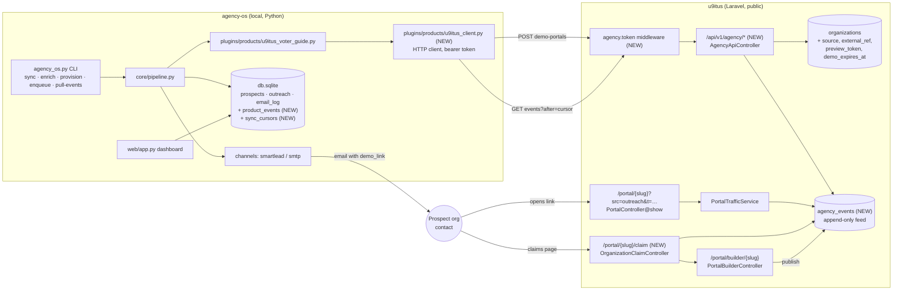
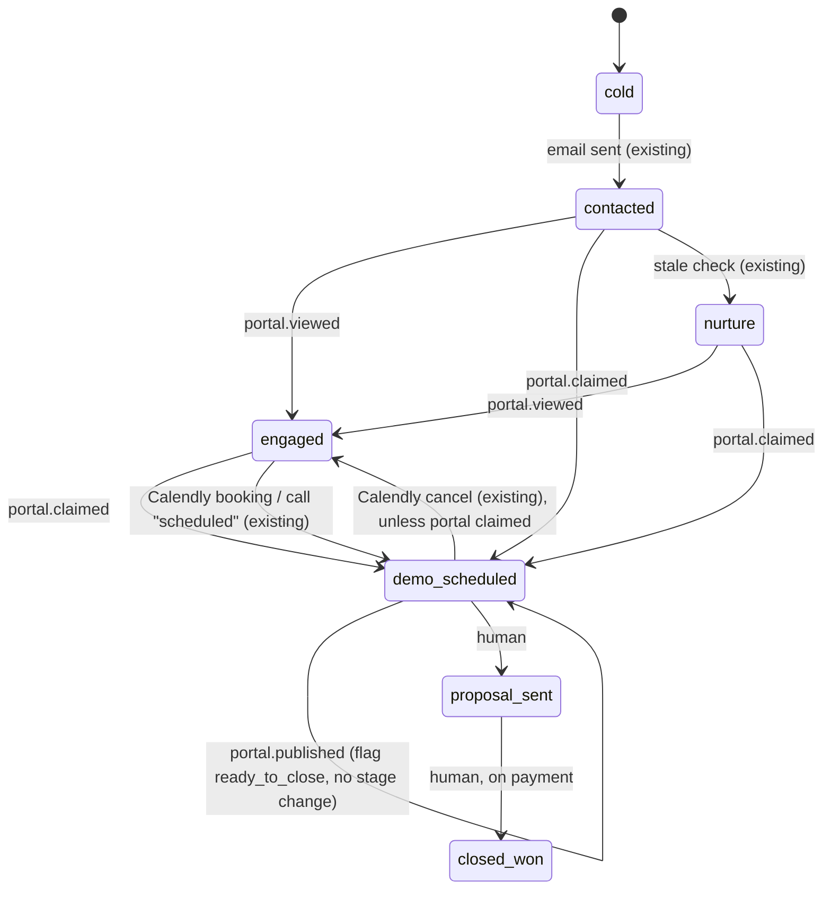

<!-- Copy of u9itus.dev doc/AGENCY_OS_INTEGRATION.md (the u9itus repo copy is the source of truth). -->

# agency-os ↔ u9itus portal integration

Spec for connecting **agency-os** (sales outreach engine, this repo,
Python/SQLite/FastAPI) to the **u9itus white-label portal builder** (`/Volumes/PRO-BLADE/Github/u9itus.dev`,
Laravel). Written for a coding agent implementing it: diagrams are Mermaid, the
contract is YAML, and tasks have file paths and acceptance checks.

Status (2026-10-02):
- **u9itus side built** (U1–U10, tests in `tests/Feature/Portal/AgencyApiTest.php`),
  on branch `feature/white-label-portal-builder`. **Not deployed yet**: production
  returns 404 for `/api/v1/agency/*` until the branch is merged.
- **agency-os A1–A10 built** (A1–A5, A8, A9 in agency-os commit `5c3905a`; A6, A7,
  A10 and follow-up fixes added 2026-10-02, see section 9).
- **End-to-end tested locally** against the real agency-os code (section 9).

Owner decisions are in section 8. Deployment and setup are in section 9.

## Goal

Each prospect in an outreach campaign gets a **personal demo portal**: their
name, their state's ballot measures and candidates, and a "claim this page" link.
agency-os sends the link in its emails, and u9itus reports back when the prospect
views or claims the page. agency-os then advances the pipeline stage without
anyone updating it by hand.

## Constraints that shape the design

| Fact | Consequence |
|---|---|
| agency-os started on a laptop and now also runs on Railway (`agency-os-production-759a.up.railway.app`, SQLite on a volume, behind a login) | agency-os **pulls** an event feed on a schedule. That works from both places and needs no public webhook endpoint or webhook signing on the agency-os side. |
| `Pipeline._build_variables()` calls `product.generate_demo_link()` *before* the `dry_run` check in `enqueue_outreach()` (`core/pipeline.py`) | Provisioning must **not** happen inside `generate_demo_link()`. It needs its own step, and dry runs must never call the API. |
| u9itus `organizations` already has `claim_email`, `claim_token`, `claim_requested_at`; politicians have a working claim flow (`ProfileClaimController`) | Org claiming reuses that pattern. Don't invent a new one. |
| Portal traffic is counted per `?src=` tag with no cookies or stored IPs (`PortalTrafficService`) | Demo views reuse it. Add the source `outreach`, and don't add per-person tracking pixels. |
| Prospects are real organizations | A demo page must never state positions or endorsements they didn't make, must be labeled as a sample, must stay out of search engines, and must expire. |

## 1. System map



## 2. Lifecycle (one prospect)

```mermaid
sequenceDiagram
  autonumber
  participant A as agency-os
  participant U as u9itus API
  participant P as Prospect
  participant W as u9itus portal

  Note over A: daily cron, after enrich, before enqueue
  A->>U: POST /api/v1/agency/demo-portals {external_ref, name, state, ...}
  U-->>A: 201 {slug, demo_url, claim_url, expires_at} (200 if it already exists)
  A->>A: outreach.demo_link = demo_url; prospect.metadata.u9itus = {slug, claim_url}
  A->>P: email touch 1 ({{demo_link}})
  P->>W: GET /portal/{slug}?src=outreach&t={preview_token}
  W->>U: record visit, append event portal.viewed (first view per day)
  Note over A: daily cron
  A->>U: GET /api/v1/agency/events?after={cursor}
  U-->>A: [{id, type: portal.viewed, external_ref, ...}], next_cursor
  A->>A: stage contacted → engaged; log to activity_log
  P->>W: claim page (email verification)
  W->>U: append portal.claimed
  P->>W: edits in builder, publishes
  W->>U: append portal.published
  A->>U: GET events
  A->>A: stage → demo_scheduled (claimed); flag "ready to close" (published)
```

## 3. Pipeline stage mapping

Events only move a prospect **forward**, never backward, and never out of
`closed_won`/`closed_lost`. `closed_won` is always set by a human, because
payment happens outside both systems.

Implement A4 the way `Pipeline.sync_bookings()` (Calendly) already works: skip
an event whose `ref` is already in `activity_log`, and keep a set of later stages
it must not pull a prospect back from.



`portal.claimed` → **`demo_scheduled`** (owner decision). That's the same stage a
Calendly booking sets, so A4 has to coordinate with `sync_bookings()`:

- If the prospect is already `demo_scheduled` because of a booking, a claim
  doesn't change the stage. It only adds a `portal_claimed` entry to `activity_log`.
- A Calendly cancellation currently moves `demo_scheduled` back to `engaged`.
  Change it so it **doesn't** do that when `activity_log` has a `portal_claimed`
  entry, because the prospect is still in the product (task A10).

## 4. Contract (machine-readable)

```yaml
version: 1
base_url: ${U9ITUS_BASE_URL}          # agency-os .env, e.g. https://www.u9itus.com
auth:
  scheme: bearer
  header: "Authorization: Bearer ${U9ITUS_AGENCY_TOKEN}"
  server_side: >
    u9itus stores only the SHA-256 of the token in config('services.agency_os.token_hash')
    (env AGENCY_OS_TOKEN_HASH). Middleware compares with hash_equals. 401 on mismatch.
    No user session; a token is not a User. Rate limit throttle:60,1.
  rotation: replace env value; old token stops working immediately.

endpoints:
  - id: create_demo_portal
    method: POST
    path: /api/v1/agency/demo-portals
    idempotency: external_ref is unique; repeat calls return 200 with the existing portal (no update unless refresh=true)
    request:
      external_ref: { type: string, required: true, max: 64, example: "agency-os:prospect:1234" }
      name:         { type: string, required: true, max: 160 }
      org_type:     { type: enum, values: [pac, union, c4_nonprofit, c3_nonprofit, cbo, student_org, campaign_coalition], default: cbo, source: config/organizations.php }
      state:        { type: string, required: true, pattern: "^[A-Z]{2}$" }
      district:     { type: string, required: false }
      website_url:  { type: url, required: false, scheme: https }
      ein:          { type: string, required: false, pattern: "^\\d{2}-?\\d{7}$", note: "validated, not stored yet" }
      contact_email: { type: email, required: false, note: "pre-fills claim form; never shown on the portal" }
      refresh:      { type: bool, default: false, note: "rebuild starter layout if still unclaimed" }
    response_201_or_200:
      slug: string
      demo_url: "https://…/portal/{slug}?src=outreach&t={preview_token}"
      claim_url: "https://…/portal/{slug}/claim?t={preview_token}"
      status: { enum: [demo, claimed, published, expired] }
      expires_at: iso8601
    errors: { 401: bad token, 503: AGENCY_OS_TOKEN_HASH not set, 422: validation }
    claimed_portals: returned as-is (status claimed/published, demo_url null); refresh never touches them

  - id: get_demo_portal
    method: GET
    path: /api/v1/agency/demo-portals/{external_ref}
    response: same shape as create, plus traffic: { views_30d: int, last_viewed_on: date|null }

  - id: list_events
    method: GET
    path: /api/v1/agency/events
    query: { after: "int event id, default 0", limit: "1..200, default 100" }
    ordering: ascending id; stable; append-only
    response:
      events: [ { id: int, type: event_type, external_ref: string, slug: string, occurred_at: iso8601, data: object } ]
      next_cursor: int     # last id returned; pass as `after`
    retention: 90 days

event_types:
  portal.viewed:     { data: { source: outreach, visitors_today: int }, emitted: "first counted visit per portal per day; owner/bots excluded (PortalTrafficService rules)" }
  portal.claimed:    { data: { }, emitted: "claim verified; org now has user_id" }
  portal.published:  { data: { }, emitted: "portal_published false→true" }
  portal.expired:    { data: { }, emitted: "scheduled job, unclaimed demo past expires_at" }
  # Never in the feed: claimant name/email, visitor data, endorsement content.
```

## 5. What a demo portal looks like (u9itus side)

- It's created like `portal:create` from the shared starter layout
  (`PortalStarterLayout`: Hero, candidates, ballot measures) for
  `state`/`district`, but with **no endorsements block and no positions**. The Hero
  banner reads "Your voter guide: who and what is on your ballot, in plain
  language.", not a claim made in their voice.
- There is **no logo**. Don't scrape or copy the prospect's logo, because that would
  impersonate them. The header uses their name plus a neutral color.
- A fixed, non-removable bar reads: "Sample preview prepared by u9itus for {name}.
  Not affiliated with or endorsed by {name}. [Claim this page]". It is hidden once
  the page is claimed.
- The page is only reachable with a valid `t=` preview token while it's unclaimed:
  404 without the token, `X-Robots-Tag: noindex, nofollow`, and excluded from the
  sitemap. Only a claim plus publish makes it public at the plain URL.
- It expires **60 days** after it is created (`demo_expires_at`; owner decision;
  config `services.agency_os.demo_days`, default 60). `portal:expire-demos` runs
  daily at 03:30 and clears the preview token, so the link stops working. The row
  is kept. Calling `create_demo_portal` again for an expired, unclaimed demo
  restores it with a new 60-day window and a new preview token.
- The demo's slug is always the name plus a 5-character suffix
  (`eastside-families-united-x7k2q`). `portal:create` looks organizations up by
  slug, so staff provisioning the real org later must not land on the demo.
- The demo page sends `Referrer-Policy: no-referrer`, so the preview token
  doesn't leak to sites linked from it.
- Claiming (`OrganizationClaimController`) takes four steps, because the
  claimant may not have an account yet:
  1. `GET /portal/{slug}/claim?t=…`: the form. It needs the live preview token, so
     only the email recipient can reach it. The email field is pre-filled with
     agency-os's `contact_email`.
  2. `POST`: emails a one-time link. Only the token's SHA-256 is stored, and the
     link expires in 48 hours.
  3. `GET …/claim/verify?token=…`: sets `claim_verified_at` and sends the claimant
     to sign in (login returns them through the intended URL) or register.
  4. `GET …/claim/complete` (signed in): `OrganizationPolicy::claim` decides by
     user type (below). On success it sets `user_id`, clears the preview token,
     appends `portal.claimed`, and opens the builder. The signed-in email must
     match the verified one, within 7 days.

### Claim permissions by user type

The owner's rule is that the claiming email's permissions follow its user type.
This is how it's implemented in `OrganizationPolicy::claim` (**the per-row
details are still to be confirmed by the owner**):

```yaml
claim_permissions:            # keyed by users.user_type of the verified email's account
  no_account:                 # email has no user yet
    action: >
      register through the normal flow, then open the complete link (shown after
      verifying, valid 7 days). Not auto-created: "citizen" registration is the
      advertiser sign-up (phone, address, business), so it's the wrong default.
  citizen:
    can_claim: true
    becomes: owner (organizations.user_id)
    can: [edit_layout, upload_logo, publish, share_and_traffic, endorse]
  voter:
    can_claim: true
    becomes: owner
    can: [edit_layout, upload_logo, publish, share_and_traffic, endorse]
  politician:
    can_claim: false          # a candidate shouldn't run an org's voter guide that covers their own race
    on_attempt: staff emailed (mail.admin_address, at most daily per portal); staff can assign an owner with portal:create --owner
  admin:                      # platform staff (AdminAccess::isStaff)
    can_claim: true
    becomes: staff override, not owner. Can assign the portal to another user.
    can: [all]
always:
  # The org type still limits the content, whoever the user is:
  endorse_candidates: Organization::canEndorseCandidates()   # c3_nonprofit and cbo → ballot-measure positions only
```

Enforce this in `OrganizationPolicy` (new `claim` ability). Don't rely on the
controller alone.

## 6. Tasks

### u9itus (the u9itus.dev repo) — done 2026-10-02

| # | Task | Files | Done when |
|---|---|---|---|
| U1 | Migration: `organizations` + `source` (string, default `manual`), `external_ref` (unique nullable, 64), `preview_token` (char 64 nullable), `demo_expires_at`; new `agency_events` table (`id`, `organization_id` FK cascade, `type`, `data` json, `occurred_at`, index on id) | `database/migrations/` | migrates up/down cleanly |
| U2 | `AgencyApiAuth` middleware (alias `agency.token`), `agency:token` command + `services.agency_os.token_hash` config | `app/Http/Middleware/`, `config/services.php`, `bootstrap/app.php` alias | 401 without/with wrong token; constant-time compare |
| U3 | `AgencyApiController` (create, show, events) + FormRequest | `app/Http/Controllers/Api/`, `routes/api.php` under `v1` | idempotent on `external_ref`; contract shapes exactly |
| U4 | `DemoPortalService::provision()` sharing the starter layout with `CreatePortal` (extract it; don't duplicate) | `app/Services/`, `app/Console/Commands/CreatePortal.php` | `portal:create` tests still pass |
| U5 | Preview-token gate, noindex header, sample bar in `show.blade.php` | `PortalController@show`, view | unclaimed demo 404s without `t`; bar present; claimed page has no bar |
| U6 | Add `outreach` to `PortalTrafficService::sources()`; emit `portal.viewed` once per portal per day from `record()` | `PortalTrafficService` | the builder traffic table shows an "Outreach email" row |
| U7 | `OrganizationClaimController` (show, submit, verify) and mail; `OrganizationPolicy::claim` per the claim-permissions table | `app/Http/Controllers/Standalone/`, `app/Policies/OrganizationPolicy.php`, `routes/standalone.php` | emits `portal.claimed`; token single-use; politician account is refused and queued for review |
| U8 | Emit `portal.published` in `PortalBuilderController@update` on false→true | controller | event emitted once per transition |
| U9 | `portal:expire-demos` scheduled daily (60-day lifetime); prune events older than 90 days | `app/Console/Commands/`, `routes/console.php` | emits `portal.expired`; re-provisioning restores |
| U10 | Pest tests for every row above | `tests/Feature/Portal/AgencyApiTest.php` | full suite green |

### agency-os (this repo)

| # | Task | Files | Done when |
|---|---|---|---|
| A1 | `U9itusClient` (requests/httpx, 10s timeout, retries on 5xx, never logs the token) | `plugins/products/u9itus_client.py` | unit-tested with a mocked transport |
| A2 | Product methods `provision_demo(prospect, outreach) -> dict` and `pull_events(after) -> (events, cursor)`. `generate_demo_link()` returns `outreach.demo_link` if set, else the current `/compare?state=` link, and **makes no HTTP call** | `plugins/products/u9itus_voter_guide.py`; optional methods documented in `core/protocols.py` | dry-run makes zero network calls |
| A3 | CLI `provision --campaign X [--limit N] [--dry-run]`: for outreach rows with a contact email and no `demo_link` at stage cold/contacted, call `provision_demo` and store `demo_link` + `prospect.metadata["u9itus"]` | `core/cli.py`, `core/pipeline.py` | rerunning creates no duplicates |
| A4 | CLI `pull-events [--all] [--dry-run]`: page through events, map them to stage changes (section 3), append to `activity_log` with `ref = "u9itus:{event id}"`, save `sync_cursors(product_key, cursor)`. Same shape as `sync_bookings()` | `core/cli.py`, `core/pipeline.py`, `core/db.py` | idempotent: same events twice → one change |
| A5 | New tables `product_events` (raw event, unique on product_key+event_id) and `sync_cursors` | `core/db.py` schema | created on startup like existing tables |
| A6 | Dashboard: prospect detail shows portal status, views, claim link, a "Provision demo" button, and a "ready to close" badge | `web/app.py`, `web/templates/` | — |
| A7 | Run `provision` daily and `pull-events` hourly **inside the Railway web service** (see section 9; a separate cron service can't reach the SQLite volume) | `web/app.py` or a protected run endpoint | jobs run on Railway without anyone's laptop |
| A8 | `.env.example`: `U9ITUS_BASE_URL`, `U9ITUS_AGENCY_TOKEN` | `.env.example` | — |
| A9 | Cold cadence only runs for `cold`/`contacted`; a send never moves the stage backward (keep a stage order list; take the later of current and `next_stage`) | `core/db.py` `get_due_outreach`, `core/pipeline.py` `enqueue_outreach` | an `engaged` prospect gets no cold touch and keeps its stage |
| A10 | `sync_bookings()`: a cancellation doesn't move a prospect back to `engaged` if `activity_log` has an entry of type `portal.claimed` (the type A4 writes) | `core/pipeline.py` | test: claimed + canceled stays `demo_scheduled` |

agency-os status (2026-10-02): **all of A1–A10 done.** To turn on the scheduled jobs
on Railway, set `AGENCY_OS_RUN_JOBS=1` (section 9).

## 7. Guardrails

- **Secrets:** the token lives only in agency-os `.env` (gitignored) and as a hash
  in u9itus env. Never put it in campaign YAML, logs, or the dashboard.
- **No fabricated speech:** demo portals never contain endorsements, positions,
  quotes, or a "Paid for by" line in the prospect's name.
- **Email copy:** the unsupported "30% increase" claim was removed from
  `01_followup_impact.yaml` (2026-10-02). Keep statistics out of the scripts
  unless there's a real, citable result behind them.
- **Link scanners can fake a view.** Corporate mail security (Microsoft Safe Links,
  Proofpoint, Mimecast) often opens links before a person does, and some of these
  scanners look like a normal browser. A `portal.viewed` that arrives within a minute or
  two of sending may be a scanner. agency-os should treat `engaged` from a single
  early view as soft (for example, ignore a view under 2 minutes after the send).
  A future u9itus option is to count a demo view only from a script beacon after
  the page has rendered.
- **Privacy:** the event feed carries no visitor or claimant personal data, and the
  traffic rules (no cookies or IPs, bots and owners excluded) stay as they are.
- **Stop the cold sequence once they engage.** Two current behaviors break this
  (task A9): `Database.get_due_outreach()` only skips `closed_won`, `closed_lost` and
  `nurture`, so `engaged` and `proposal_sent` prospects keep getting cold emails; and
  `enqueue_outreach()` sets `stage = step.next_stage` on every send, which
  would knock an `engaged` prospect back to `contacted`.

## 8. Decisions (owner, 2026-10-02)

1. `portal.claimed` → **`demo_scheduled`**.
2. Unclaimed demos last **60 days**.
3. Claim permissions **follow the user type** of the verified email. Built as
   the table in section 5; the per-type details still need the owner's confirmation.
4. Coalition tier (umbrella org with partner portals): **later**. Don't add
   `parent_organization_id` now.

## 9. Deployment and setup

### Environments

| | u9itus | agency-os |
|---|---|---|
| Production | `https://www.u9itus.com` (Railway: web, queue, scheduler services) | `https://agency-os-production-759a.up.railway.app` (Railway, one web service, SQLite on a volume) |
| Health check | `/up.php` | `/healthz` → `{"ok":true}` |
| Agency API | `/api/v1/agency/*`, live once this branch is merged and deployed | client in `plugins/products/u9itus_client.py` |

### Create the token

Run this once, from the u9itus repo (it needs no database and stores nothing):

```bash
php artisan agency:token
```

It prints two lines. Each goes in a different place:

| Value | Where it goes | Notes |
|---|---|---|
| `AGENCY_OS_TOKEN_HASH=…` | u9itus **web** service variables on Railway | Only a hash; safe to keep in Railway variables |
| `U9ITUS_AGENCY_TOKEN=…` | agency-os service variables on Railway (and a local `.env` for CLI runs) | The secret. Shown once. Share it through a password manager, never chat or email |

Also set `U9ITUS_BASE_URL=https://www.u9itus.com` on agency-os. To rotate the token, run
the command again and replace both values; the old token stops working immediately.
Until the hash is set, the API answers `503 service_not_configured`.

### Running the jobs on Railway (A7, done)

The web app runs the jobs itself (`core/jobs.py`): a
background loop started with the app wakes every 5 minutes and runs any job whose
interval has passed since its last run. Runs are recorded in the `job_runs` table,
so a redeploy doesn't re-run a job that just ran.

| Job | Default interval | Setting |
|---|---|---|
| `pull-events` (once per product, all active campaigns) | 60 min | `AGENCY_OS_PULL_EVENTS_MINUTES` |
| `provision` (each active campaign) | 24 h | `AGENCY_OS_PROVISION_MINUTES` |

- **Off by default.** Set `AGENCY_OS_RUN_JOBS=1` on the Railway service to turn it
  on. Local runs and tests never call u9itus.
- Owners see **Team → Jobs** (`/admin/jobs`): last run, result, recent runs, and a
  **Run now** button for each job. A run with the u9itus API unconfigured shows as a problem.
- Sending email (`enqueue`) is deliberately not scheduled; it stays a manual step.

The CLI's `--db` defaults to `$DATABASE_URL`, which is set on the Railway
service, so `railway run` and a shell there use the real database.

### End-to-end test (2026-10-02)

The real agency-os code was run against a local u9itus from this branch, using a
throwaway token and a scratch agency-os database:

| Step | Result |
|---|---|
| API with no token / with token | 401 / 200 |
| `provision --dry-run` | listed 1 prospect, no API calls |
| `provision` | demo created; `demo_link` and `metadata.u9itus` stored |
| `provision` again | 0 to provision (idempotent) |
| Visitor opens `demo_link` | 200, one `portal.viewed` event |
| `pull-events` | `contacted → engaged`, cursor saved |
| Claim + publish events, `pull-events` | `engaged → demo_scheduled`, `ready_to_close` flag added |
| `pull-events` again | nothing changes (idempotent) |
| A lone `portal.published` in a later pull | **crashed** (`UnboundLocalError: json`); fixed in agency-os `core/pipeline.py` |

Fixes made to agency-os during the test (uncommitted in that repo):
- `core/pipeline.py`: `json` is imported at module level. It had been imported
  inside a branch, so a publish event arriving without a stage change crashed
  every later pull.
- `core/pipeline.py`: `portal.published` now only adds the `ready_to_close` flag.
  Before, it also moved an `engaged` prospect to `demo_scheduled`.
- `tests/test_u9itus_events.py`: 6 tests covering the stage mapping, the crash,
  idempotency and unknown prospects. They fail on the old code and pass on the fix.
  All 45 agency-os tests pass.

### A6, A7, A10 and follow-up fixes (2026-10-02, agency-os, uncommitted)

- **A6, prospect page:** a "u9itus demo page" card with status (Demo live, Expired,
  Claimed, Published), Open/Copy link, link expiry, 30-day views, and the portal
  events (viewed, claimed, published). It has **Create demo page**, **Renew demo
  page** (expired) and **Refresh status** buttons, and a **ready to close** badge
  next to the stage. The buttons need the new `portals.manage` permission. It's in
  the Sales Rep starter role for new installs; **owners must add it to existing
  roles under Team → Roles.**
- **A7:** see above.
- **A10:** a canceled Calendly meeting no longer moves a prospect who claimed their
  page back to `engaged`.
- **Emails now use the demo link.** `_build_variables()` never passed the
  provisioned link to the product, so every email used the generic `/compare` page.
- **Events reach the prospect in every campaign.** The event cursor is per product,
  but events were only applied to the campaign being pulled. With two campaigns on
  the same product, the second campaign's events were consumed and lost.
- **A claim is always logged**, even when the prospect is already
  `demo_scheduled` from a booking. A10 depends on that entry.
- **A view or claim revives a `nurture` prospect**, as section 3 specifies.
- **`portal.expired` clears the dead demo link** and marks the status expired, so the
  next `provision` run issues a new link.
- Tests: `tests/test_u9itus_events.py` (12), `tests/test_portal_dashboard.py` (10),
  and an A10 test in `tests/test_twilio_calendly.py`. 61 pass. The one failure,
  `test_every_route_has_a_rule_and_no_rule_is_stale`, already fails on `main`: the
  permissions map lists `/admin/campaigns` routes that the app doesn't define yet
  (campaign segmentation work in progress).

Production check (read-only): agency-os `/healthz` is ok, pages redirect to
`/login`, and `/api/stats` returns 401 without a session. u9itus production returns
404 for the agency API, as expected before this branch is deployed.

